# Bio-dash

Live browser dashboards for BLE biometric and environmental sensors, built for Linux (Jetson Orin Nano, x86 laptops) using BlueZ. Each dashboard has two parts. A **hardware worker** talks to the device over Bluetooth and logs to CSV, and a **web app** streams that data to charts in the browser.

| Dashboard | Device | Streams | Port | Launch |
|---|---|---|---|---|
| `polar_dashboard/` | Polar H10 chest strap | ECG 130 Hz, accelerometer 200 Hz, HR, R-R / RMSSD | 5001 | `./run_dashboard.sh` |
| `viatom_dashboard/` | Viatom Checkme O2 Ultra (advertises as `Band-WU …`) | SpO₂, pulse, battery | 5003 | `./run_dashboard.sh` |
| `atmos_dashboard/` | Any Atmos device: **Atmos-Mini** (SEN69C), **Atmos-Sphere S4** (SCD30 + SEN44 + SFA3X), **S5** (SCD30 + SEN55 + SFA3X), or anything sending CSV / key=value / JSON over Nordic UART | Whatever the device reports: CO₂, PM1–10, temp / RH, VOC, NOx, HCHO, plus any unrecognised fields | 5002 | `./run_dashboard.sh` |
| `Omni-dashboard/` | Polar H10 + Viatom O2 at the same time | Both of the above in one view, each on its own radio when two are available | 5000 | `./run_dashboard.sh` |
| `hydro_dashboard/` | **HidrateSpark** smart bottle (PRO / PRO 2) | Sips with timestamps, intake vs. goal, fill level, refills, battery | 5004 | `./run_dashboard.sh` |
| `analysis_dashboard/` | *No device:* reads what the others recorded | Summaries per day or range, every signal on one clock, CSV export, overnight reports | 5005 | `./run_dashboard.sh` |

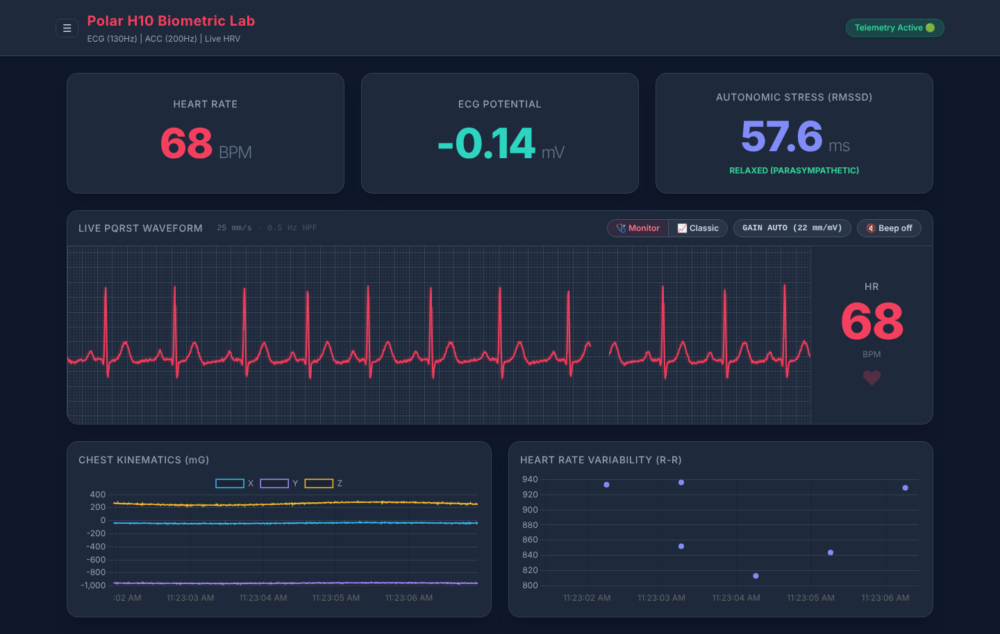

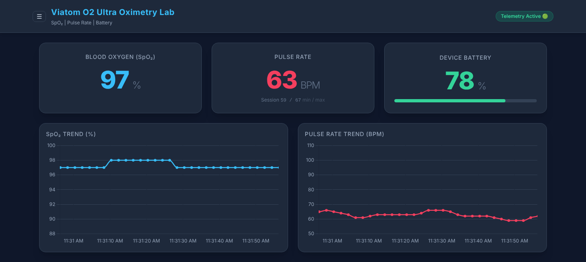

> ⚠️ **Not a medical device.** The stress/HRV labels are rough RMSSD thresholds for experimentation, not clinical interpretation.

## Requirements

- Linux with BlueZ and a working Bluetooth adapter
- Python **3.10+** (required by `polar-python`)
- Omni: works with one radio. **Two radios are recommended**, e.g. the built-in card plus a USB dongle, so the H10 can have one to itself (see *Omni radio routing* below).

The easiest setup is an isolated virtual environment, which keeps these packages separate from anything else installed on the machine:

```bash
./setup_env.sh                     # creates .venv/ with all six dashboards' packages
./setup_env.sh polar_dashboard     # or just one dashboard
./setup_env.sh --fresh             # wipe and rebuild
```

Once `.venv/` exists, the launch scripts use it automatically, so you don't need to activate it. For your own testing, run `source .venv/bin/activate`.

Or install system-wide instead: `pip3 install -r requirements.txt`.

## Usage

```bash
./launch.sh                 # Polar + Viatom + Atmos together (Ctrl+C stops them all)
./launch.sh polar atmos     # or any combination
./launch.sh omni atmos      # Omni runs the Polar and O2 itself, so it can't be combined with polar/viatom

polar_dashboard/run_dashboard.sh    # or one dashboard on its own
```

Every dashboard has its own port (**Omni 5000 · Polar 5001 · Atmos 5002 · Viatom 5003 · Hydro 5004 · Analysis 5005**), and the sidebar links to the others that are running (a dashboard that isn't running isn't listed; it appears within about 10 seconds of starting).

1. Wake the device. The H10 needs wet electrodes. The O2 Ultra only advertises while it's powered on and measuring.
2. Pick it from the scanner panel and click **Connect**.
3. Charts start as soon as data arrives. If the device goes quiet, the scanner comes back automatically.

`Ctrl+C` stops both the worker and the web server. Recordings are saved to your Documents folder; see *Where recordings are saved* below.

> The Omni launcher runs `sudo systemctl restart bluetooth` to clear stale BlueZ state, so it will ask for your password.

## Project layout

Each dashboard keeps its Python and web front end separate:

```
polar_dashboard/
├── advanced_worker.py      # BLE worker: talks to the device, writes CSV
├── bt_debug.py             # radio discovery + rate meters for the debug panel (Polar, Viatom, Atmos)
├── atmos_parser.py         # (Atmos) line formats, field-name normalisation, device profiles
├── app.py                  # web server: API + live stream (no HTML inside)
├── requirements.txt
├── run_dashboard.sh
├── templates/index.html    # page markup
└── static/
    ├── js/dashboard.js     # charts, scanner panel, stream handling
    ├── js/ecg_monitor.js   # (Polar, Omni) bedside-monitor ECG sweep renderer
    ├── js/ecg_view.js      # (Polar, Omni) 🩺 Monitor / 📈 Classic ECG toggle
    ├── js/tile_trends.js   # tap-a-tile trend graphs (all dashboards; shared module)
    ├── js/debug_panel.js   # 🐞 debug panel (Polar, Viatom, Atmos)
    ├── js/sidebar.js       # sidebar: dashboard links, debug, keep-awake, updates, power (all dashboards)
    ├── css/tailwind.css    # compiled Tailwind (all dashboards)
    └── vendor/             # Chart.js, Luxon, adapter, streaming plugin
```

The analysis dashboard has no worker: `analysis_dashboard/biodata.py` reads the recordings
(also used by `tools/interpolate.py`), `app.py` serves the page, `sample_data.py` writes made-up
recordings to try it with, and `test_biodata.py` checks the numbers.

`templates/index.html` is served as a plain file, not rendered through Jinja, so you can edit the HTML, JS and CSS directly and just refresh the browser. Only changes to the `.py` files need a restart.

## Offline use

The dashboards don't need internet access. Every library is included under each dashboard's `static/`:

| Library | Version | Used by |
|---|---|---|
| Chart.js | 3.9.1 | All six |
| Luxon + chartjs-adapter-luxon | 3.0.1 / 1.2.0 | All six |
| chartjs-plugin-streaming | 2.0.0 | The five live dashboards |
| Tailwind CSS (compiled, not the play CDN) | 3.4 | The five live dashboards (Analysis has its own small stylesheet) |

To re-download them, or after changing a version in the script:

```bash
./fetch_vendor.sh              # wget the JS libs from jsDelivr, verify SHA-256
./fetch_vendor.sh --tailwind   # also rebuild tailwind.css (needs Node/npx)
```

Tailwind CSS is compiled, so it only contains classes that already appear in `templates/` and `static/js/`. **If you add a new Tailwind class, run `./fetch_vendor.sh --tailwind`,** or the new class will have no effect.

## How it works

Flow diagrams of the whole suite — devices, radios, workers, recordings, the Hydro-dash bottle
protocol and the Atmos parser: **[docs/ARCHITECTURE.md](docs/ARCHITECTURE.md)**.

```
 BLE device ──► worker (bleak) ──► CSV log ──► web app (tails file) ──► browser
                     ▲                              │
                     └──── command.json ◄───────────┘  (Connect clicks)
```

- **Workers** own the Bluetooth link. They write every sample to CSV, write `devices.json` for the scanner panel, and read `command.json` when you click Connect. The Polar worker also writes `status.json` (scanning / connecting / streaming).
- **Web apps** follow the newest CSV and push batches to the browser. Polar and the air app use WebSockets; Viatom and Omni use Server-Sent Events.
- Logs are plain CSV with epoch-ms timestamps, so they open directly in pandas or a spreadsheet.

### Debug panels (Polar, Viatom, Atmos)

Press **D** or click **🐞 Debug** to open the panel:

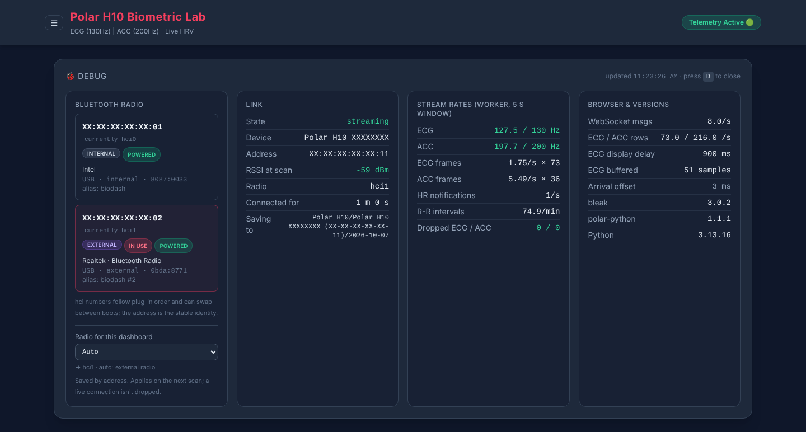

- **Bluetooth Radio:** every adapter BlueZ reports, titled by its **Bluetooth address**, with chip vendor/product, bus, power state and an **INTERNAL / EXTERNAL** tag. The one the H10 is actually using is marked **IN USE**.
  - `hciN` is shown only as "currently hciN". Linux numbers adapters in the order they come up, so a USB dongle can take hci0 and push an internal card to hci1. The address never changes.
  - Internal/external comes from the kernel's port info (`removable` / `connect_type`). Wi-Fi+BT combo cards show as **USB** because their Bluetooth half uses the M.2 slot's USB lines. Hover the tag to see how it was determined.
- **Link:** connection state and attempt count, device name/address, RSSI from the scan, and how long it has been connected.
- **Stream Rates:** ECG and ACC samples per second measured by the worker against the nominal 130 / 200 Hz (green within 2%), plus frames/s × samples per frame, HR notifications, R-R intervals per minute, and **dropped samples**, detected from gaps in the H10's own timestamps.
- **Browser & Versions:** WebSocket messages/s, rows received, ECG display delay and buffer depth, and bleak / polar-python / Python versions.

**Viatom version.** It has the same **Bluetooth Radio** and **Link** sections, adapted to how the O2 works (it answers a poll every 2 s rather than streaming):

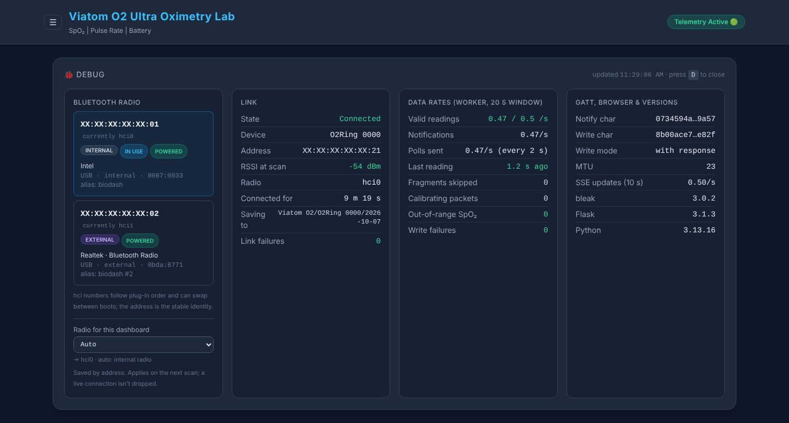

- **Data Rates** (20 s window): valid readings/s against the nominal 0.5/s, notifications/s, polls sent, time since the last reading, and counters for continuation fragments skipped, calibration (`0xA5`) packets, out-of-range SpO₂ frames and poll write failures.
- **GATT:** the notify and write characteristics in use (hover to see the full UUID), the write mode the link settled on, the MTU, SSE update rate, and versions.

**Atmos version.** It has the same **Bluetooth Radio** and **Link** sections, tuned for a Nordic UART text stream, plus a **Device Profile** section (see *Atmos dashboard* below):

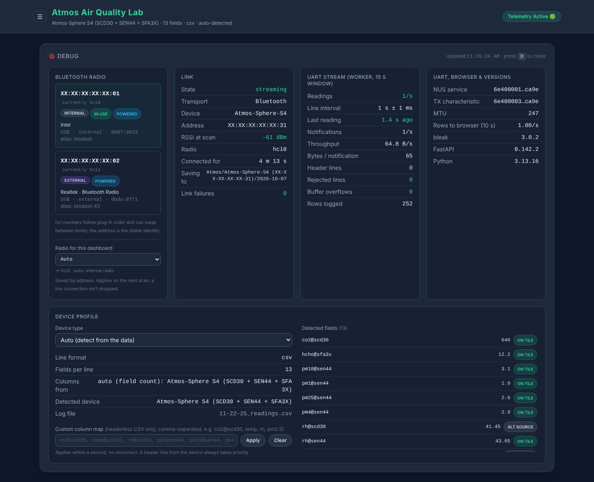

- **UART Stream** (15 s window): readings/s, the average line interval ± jitter, time since the last reading, notifications/s, throughput, bytes per notification (how the MTU is splitting lines), header lines, **rejected lines** (garbled or unparseable lines, kept out of the CSV), buffer overflows, and rows logged.
- **UART:** the NUS service and TX characteristic, the MTU, the browser row rate, and versions.

### Atmos dashboard

One dashboard for every Atmos device. It reads whatever the device sends and shows only what that device has. An S4 has no NOx tile, for example, and a board with extra sensors gets extra tiles.

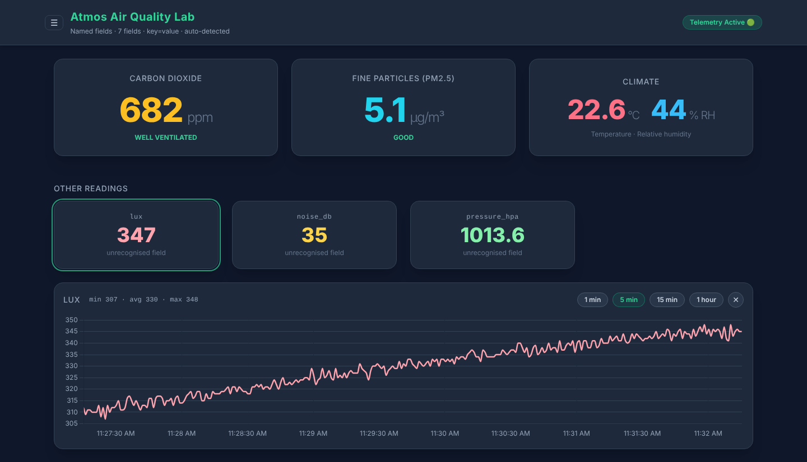

**Accepted line formats** (detected per line):

| Format | Example |
|---|---|
| JSON | `{"scd30_co2": 612, "sen55_temp": 22.4}` |
| key=value | `co2=612, temp=22.4, pm2.5=3.1` (also `key: value`) |
| CSV with a header line | `CO2_ppm,Temp_C,RH` once, then numeric rows |
| Bare numeric CSV | `612,22.4,41.0,…`, mapped by the device profile |

**Field names** are normalised, so `CO2_ppm`, `PM2.5 [µg/m³]`, `Humidity_RH`, `SCD30 Temp` and `sen55_rh` all land on the right tiles. A sensor name in the field keeps sources apart (`temp@scd30`, `temp@sen55`). When several sensors report the same quantity (the Spheres have three temperature/RH sources), the tile uses the best one: SEN5x/SEN6x (compensated) → SHT4x → SCD30 (runs warm) → SFA3X. The debug panel shows all of them. Fields the dashboard doesn't recognise appear under **Other Readings** with their own tap-to-trend tiles.

**Device profiles** only matter for bare numeric CSV, which has no names. Pick one in the debug panel's **Device Profile** section (**D**):

| Profile | Fields | Column order |
|---|---|---|
| Auto (default) | — | Picks by field count: 9 → S4 over Wi-Fi, 10 → Mini, 13 → S4, 14 → S5 |
| Atmos-Mini (SEN69C) | 10 | PM1, PM2.5, PM4, PM10, RH, T, VOC, NOx, HCHO, CO₂ (confirmed) |
| Atmos-Sphere S4 | 13 | SCD30 (CO₂, T, RH) · SEN44 (PM1–10, VOC, RH, T) · SFA3X (HCHO, RH, T), confirmed: the S4 firmware's BLE fallback sends exactly this, plus a header line |
| Atmos-Sphere S4 over Wi-Fi | 9 | PM1–10 (SEN44) · RH, T (averaged across the three sensors) · VOC (SEN44) · HCHO (SFA3X) · CO₂ (SCD30), confirmed from the S4 firmware's TCP stream |
| Atmos-Sphere S5 | 14 | SCD30 (CO₂, T, RH) · SEN55 (PM1–10, RH, T, VOC, NOx) · SFA3X (HCHO, RH, T), **assumed** |

The S5 order follows each Sensirion library's read order, but its sensor block order is an assumption. If readings land on the wrong tiles, either:
- have the firmware print a **header line** at connect (e.g. `co2@scd30,temp@scd30,rh@scd30,pm1@sen55,…`), which always takes priority, or
- set a **custom column map** in the debug panel.

Profile changes apply within a second, with no reconnect, and are saved to `atmos_profile.json`.

**Wi-Fi:** devices that stream CSV over TCP work too. Enter the IP (and port, default 8080) under **Connect over Wi-Fi** in the scanner panel. The Atmos-Sphere S4's Wi-Fi stream (9 fields, averaged temperature/RH, no header) is recognised automatically by its own profile. The last address is remembered. The S4 firmware serves one TCP client at a time, so close its Python client first.

**Logs** go to `Documents/Bio-dash/Atmos/<device>/<date>/<time>_readings.csv` (see *Where recordings are saved*). The header names every series, so files stay readable whichever device wrote them. If a new field appears mid-session, logging continues in a `<time>_part2_readings.csv` with the wider header.

**Tiles and charts:**
- **Headline tiles:** CO₂ with ventilation guidance (under 800 ppm well ventilated; 1000+ ventilate), PM2.5 with its US EPA AQI category (2024 breakpoints; the official AQI uses a 24 h average, so treat this as indicative), and temperature / RH.
- **Secondary tiles:** VOC and NOx indices (Sensirion's learned baseline is 100 and 1 respectively), HCHO, and PM1 / PM4 / PM10.
- **Trend charts** for CO₂, particulates, temperature & humidity, and gas indices & HCHO, with a **5 min / 15 min / 1 hour** window, pre-filled from the logs.

### Hydro-dash (HidrateSpark)

> 🧪 **Still being tested.** Hydro-dash has been run on one HidrateSpark PRO 2 so far. Working on
> that bottle: connecting, live and replayed sips, battery, and new in V3.1 the fill level from the
> bottle's own calibration, bottle size read from the bottle, and glow. **Still being confirmed:**
> reminders. Other bottle models are untested.

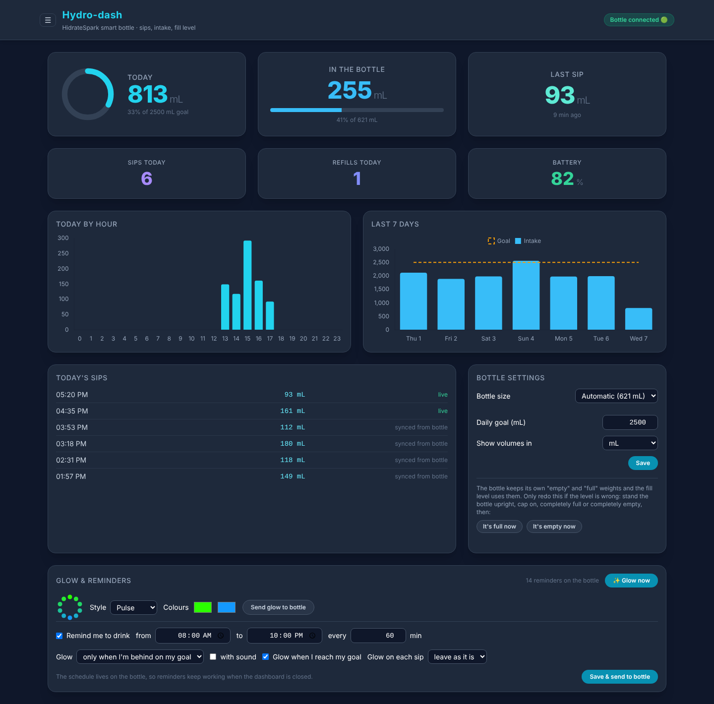

Every sip with its time (sips taken while the bottle was out of range are replayed from its buffer
with their original times), today's intake against a goal, fill level from the bottle's weight
sensor, refills and battery, with hour and 7-day charts and day-scale tile trends.

- **The bottle allows one connection at a time:** if the HidrateSpark app is on a nearby phone,
  force-quit it while the dashboard is in use.
- **Bluetooth catch: the radio matters.** A laptop's built-in radio often can't hear the bottle. An
  old (Bluetooth 4.0) USB dongle hears it instantly but then shows "connected" with no data, because
  the bottle never sends its large replies over it; capping the message size fixes that
  (`ExchangeMTU = 64` under `[GATT]` in `/etc/bluetooth/main.conf`, then restart bluetooth; it
  applies to every device on the computer). See the
  [radio diagram](docs/ARCHITECTURE.md#7-hydro-dash-which-bluetooth-radio) and
  `hydro_dashboard/TROUBLESHOOTING.md`.
- **Totals come from the sip log** (`_sips.csv`), so they survive restarts.
- **Glow and reminders:** *Glow now* lights the bottle on demand. Choose a glow **style** (pulse,
  spin, flash, solid, rainbow) and **two colours**, previewed as the LED ring, and send it to the
  bottle; it keeps that glow for *Glow now* and for reminders. The reminder schedule (from / to,
  every N minutes, only when you're behind on your goal or every time, with or without sound), glow
  on reaching the goal and glow on each sip are sent to the bottle, which runs them itself, so
  they keep working with the dashboard closed. The bottle's clock, goal and today's total are set
  on every connect.
- **No calibration step:** the bottle stores its own "empty" and "full" weights and sends them with
  every sip record; the fill level and each sip's volume are computed from those. The bottle size is read
  from the bottle too, or picked from a list of the sizes sold.
- **PRO 2:** verified on a real bottle (sips, replayed sips, battery, weight). The debug panel lists
  every characteristic with its last raw frame and every notification is saved to `_raw.csv`.
  Details: `hydro_dashboard/README.md`, `hydro_dashboard/PROTOCOL.md` and
  `hydro_dashboard/TROUBLESHOOTING.md`.

### Analysis (all devices, from the recordings)

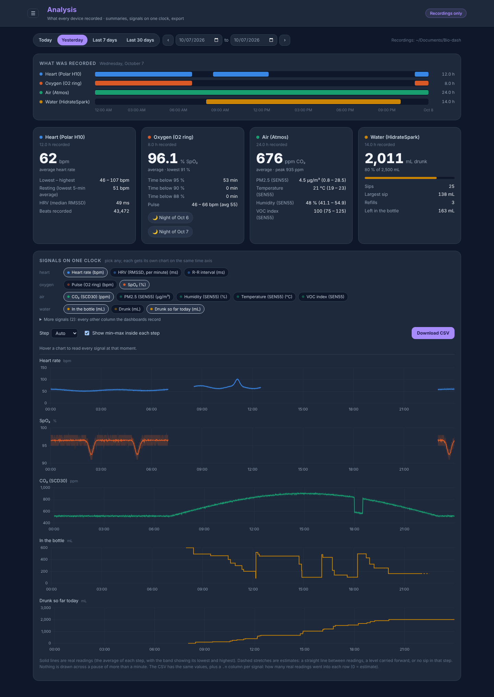

A dashboard that talks to no device: it reads the recordings the other five have saved, so it
works on any computer that has them (copy the `Bio-dash` folder over with `rsync`, say). Port **5005**.

- **Pick a range:** today, yesterday, the last 7 or 30 days, or any dates; ‹ › step through.
- **What was recorded:** a strip per device showing when it was recording and when it wasn't.
- **A card per device:** heart rate (average, range, a resting estimate, HRV), SpO₂ (average,
  lowest, time below 95 / 90 / 88 %, with a link to each night's overnight report), air (CO₂ and
  every other metric your Atmos reports), water (drunk against your Hydro-dash goal, sips, refills).
- **Day by day:** for a range, one row per day.
- **Signals on one clock:** pick any signals; each gets its own chart on a shared time axis, and
  hovering reads them all at the same moment. **Download CSV** saves exactly what's shown.

How the signals are put on one clock (the same rules as `tools/interpolate.py`):

| Signal | Example | Each step holds |
|---|---|---|
| Readings | heart rate, SpO₂, CO₂ | the **mean** of the real readings in it (the band shows their min and max); a step with none gets a straight line between the readings either side, but never across a pause of more than a minute |
| State | the bottle's fill level | the **last value**, carried forward (a straight line would invent a slow drain that never happened) |
| Events | sips | the **mL drunk** in that step, and "drunk so far today" as a running total |

Estimates are drawn dashed, and the CSV has a `.n` column per signal: how many real readings went
into that row (0 = estimate). Your recordings are only read, never changed.

No recordings yet? Try it with made-up ones:

```bash
python3 analysis_dashboard/sample_data.py /tmp/biodash-demo --days 7
BIODASH_DATA_DIR=/tmp/biodash-demo analysis_dashboard/run_dashboard.sh
```

### ECG view (Polar, Omni)

The ECG card has a **🩺 Monitor / 📈 Classic** switch. **Monitor** is the bedside-style sweep display; **Classic** is the original scrolling line. Each dashboard remembers your choice. Beat detection and the QRS beep keep working in both views; the gain control only applies to Monitor.

### Tile trends (all dashboards)

Tap any reading tile to open a live line graph of it under the tiles, with a 1 / 5 / 15 / 60 min window and min / avg / max. Tap the tile again, ✕, or Esc to close.

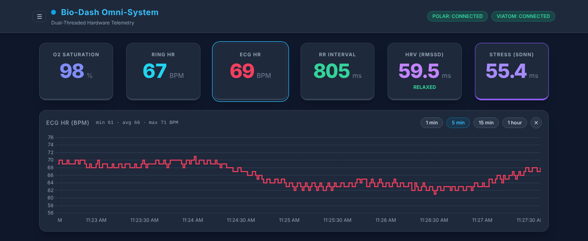

| Dashboard | Tiles | History source |
|---|---|---|
| Polar H10 | Heart rate, **ECG amplitude** (peak-to-peak per second; drops when electrode contact degrades), RMSSD | Pre-filled from this session's CSV logs |
| Viatom O2 | SpO₂, pulse, battery | Pre-filled from the daily CSV log (one row / 5 s) |
| Atmos | CO₂, PM2.5, **Climate** (temp + RH, two axes), VOC, NOx, HCHO, **Particulates** (PM1 / 4 / 10), plus a tile per unrecognised field | Pre-filled from the logs |
| Omni | SpO₂, ring HR, ECG HR, R-R, RMSSD, SDNN | Pre-filled from the newest recording of each device |

- **Drawing:** whole-number readings are drawn as steps, curves use monotone interpolation (no overshoot past real values), and each reading has a sensible minimum y-range. SpO₂ is fixed at 90–100%, battery at 0–100%.
- **Code:** it's one shared module (`static/js/tile_trends.js`), configured per dashboard at the end of each `dashboard.js`.

### Radio selection (all dashboards)

The Polar H10 keeps its radio on a tight connection schedule while streaming, which can starve other Bluetooth links on the same radio. With two radios (e.g. the built-in card plus a USB dongle), give the H10 one to itself:

- **Auto (default):** the Polar and Hydro dashboards prefer an **external** radio (a USB dongle hears the bottle far more reliably than a laptop's shared Wi-Fi / Bluetooth card), and Viatom and Atmos prefer an **internal** one. Run them side by side and they split correctly however the radios were numbered. With a single radio, everything uses the system default.
- **Pinning:** set it in each dashboard's debug panel (**D**), under **Radio for this dashboard**. The choice is saved to that dashboard's `radio_config.json` **by adapter address**, so hci renumbering doesn't matter. A pinned radio that's unplugged falls back to auto. It applies on the next scan; a live connection isn't dropped.

### Omni radio routing

While the Polar H10 streams ECG + ACC it keeps its radio on a tight connection schedule, which can starve every other Bluetooth link on that radio. Omni routes each device to a radio:

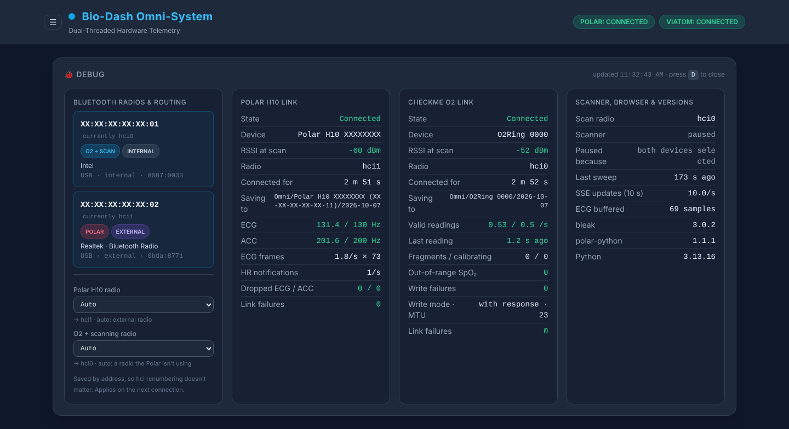

- **Auto (default):**
  - **Two or more radios:** the H10 gets an **external** radio (a USB dongle) to itself, and the O2 plus scanning use another. With no external radio, it takes the first one.
  - **One radio:** everything shares it, and scanning pauses while the H10 streams.
- **Pinning:** in the debug panel (**D**), choose a radio for the *Polar H10* and for *O2 + scanning*. Each card shows its current role (**POLAR** / **O2 + SCAN**).
  - Choices are saved to `radio_config.json` **by adapter address**, so they survive hci renumbering. A pinned radio that's unplugged falls back to auto.
  - Changes apply on the next connection. A live link isn't dropped.
- **Scanning:** pauses only if it would share the Polar's radio. On a separate radio it keeps going while the H10 streams.

### Where recordings are saved

Every dashboard saves its data to your **Documents** folder, organised by dashboard, then device, then date:

```
~/Documents/Bio-dash/
├── Polar H10/
│   └── Polar H10 D793BB2E/
│       └── 2026-09-30/
│           ├── 14-05-12_ecg.csv        ECG, 130 Hz (mV)
│           ├── 14-05-12_acc.csv        accelerometer, 200 Hz (mG)
│           └── 14-05-12_rr.csv         R-R interval per beat
├── Viatom O2/
│   └── Band-WU 0347/2026-09-30/14-05-12_vitals.csv       SpO₂, HR, battery every 5 s
├── Atmos/
│   ├── Atmos-Sphere-S4 (XX-XX-XX-XX-XX-XX)/2026-09-30/14-05-12_readings.csv
│   └── Wi-Fi 192.168.0.50-8080/…
├── Omni/
│   ├── Polar H10 D793BB2E/2026-09-30/   _ecg · _acc · _rr · _hrv (HR, RMSSD, SDNN at 1 Hz)
│   └── Band-WU 0347/2026-09-30/         _vitals (SpO₂, HR at 1 Hz)
└── HidrateSpark/
    └── h2o 3F2A/2026-09-30/             _sips · _status · _events · _raw (every notification)
```

- **One set of files per session.** Files open when a device connects and close when it disconnects, so every file belongs to exactly one sensor. The file name is the time the session started.
- **Device folder names:**
  - A device folder is named after the device.
  - When the name is shared by every unit of a model (`Atmos-Sphere-S4`, `Atmos-Mini`), its Bluetooth address is added so units never mix.
  - Wi-Fi devices are named by their address.
- **Location:** the Documents folder comes from your desktop's settings (`~/.config/user-dirs.dirs`), falling back to `~/Documents`, which suits a headless Orin. `BIODASH_DATA_DIR=/some/path` puts recordings anywhere else.
- **In the dashboards:**
  - Each debug panel (**D**) shows **Saving to**, the folder the current session is recording into.
  - Trend history and chart pre-fill read from the newest recording of the connected device.
- **Nothing is written inside the repo any more**, so recordings (including health data) can't be committed by accident. Logs from before this change stay in the old `logs_*` folders.
- **Power cuts:**
  - Recordings are pushed onto the disk every 10 seconds, so pulling the plug costs at most the last 10 seconds (`BIODASH_FSYNC_S` changes the interval).
  - A cut while a file is being written can leave a run of zero bytes at its end. When a dashboard starts, it removes those from its recordings of the last three days (a file still being written is left alone), and prints which files it repaired.
  - The analysis dashboard and the overnight report read past such zeros anyway.
  - Shutting down from the sidebar, or stopping the dashboards first, avoids it altogether.

### Running as a service (`biodash.py`)

Run dashboards in the background, optionally from boot, without keeping a terminal open:

```bash
./biodash.py                         # interactive picker (↑/↓, Space, A to apply, L for logs, Q to quit)
./biodash.py install polar atmos     # or as a command: run exactly these (replaces the current set)
./biodash.py status
./biodash.py logs polar -f
./biodash.py uninstall all
```

- **What it installs:** systemd *user* services (`~/.config/systemd/user/biodash-<name>.service`). No root is needed, stopping a service stops the whole dashboard, and a crashed dashboard restarts after 5 s.
- **Picker options:**
  - Keep the computer awake (on by default), optionally even with the lid closed.
  - Auto-reconnect to the last device (on).
  - Allow shutdown / reboot and updates from other devices, e.g. a phone (off; `--allow-power`). See below.
  - Start at boot before anyone logs in (`loginctl enable-linger`).
- **Omni** can't be combined with the standalone Polar/Viatom dashboards (same devices); the picker unticks the other side for you. Under a service, Omni skips its `sudo` Bluetooth restart, since there's no terminal to ask for a password.

### Keeping things awake

- **The computer:** services and `./launch.sh` run under `systemd-inhibit`, which blocks suspend and idle sleep while dashboards run. `BIODASH_INHIBIT_LID=1` also blocks lid-close; `BIODASH_INHIBIT=0` turns it off. If the system doesn't allow it, the dashboards still start, with a warning.
- **The screen:** **☀ Keep screen on** in the sidebar uses the browser's Wake Lock API. Browsers only allow this on `https://` or `http://localhost`, so on a LAN / Tailscale address the button is disabled and explains why.

### Sidebar (all dashboards)

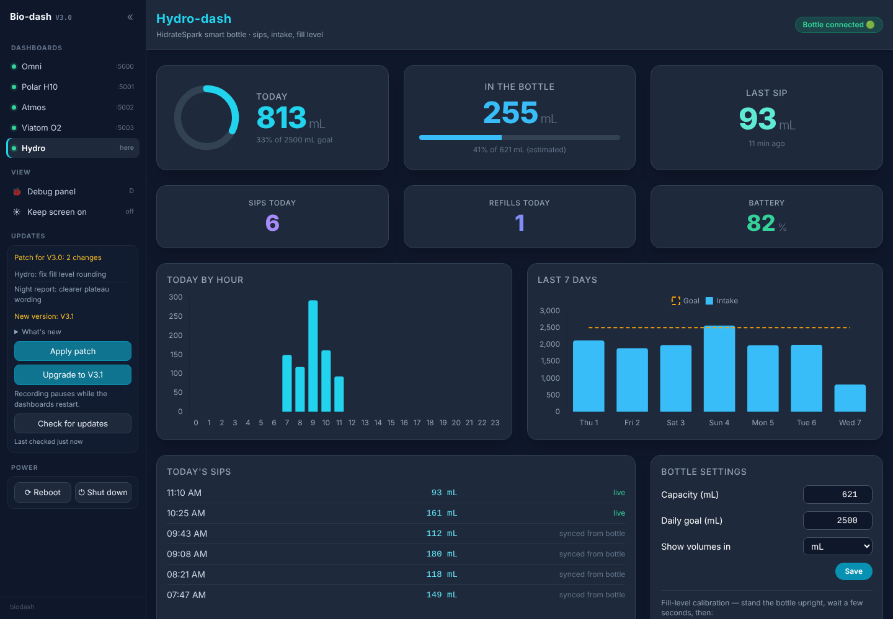

Everything that used to sit in the top bar lives in a sidebar, the same in every dashboard:

- **Dashboards:** links to the others that are running, in port order. A dashboard that isn't running isn't listed.
- **View:** the 🐞 debug panel (still **D**) and **☀ Keep screen on**.
- **Updates** and **Power:** see the next two sections.

It's closed when a page opens: **☰** in the header opens it (beside the page on wide screens,
as a slide-over drawer on phones and narrow windows) and **«** hides it again. The header keeps only the
dashboard's title and its connection status.

### Updates (sidebar)

**Check for updates** asks GitHub what's new and offers up to two separate actions:

| | What it is | What it does |
|---|---|---|
| **Apply patch** | New commits for the version you're running (same folder) | `git pull`, refresh `.venv` if the requirements changed, restart the services |
| **Upgrade to Vx.y** | A newer `V*_Dashboard` folder exists | Pull, build the new folder's `.venv`, copy your saved settings across, re-point the services at it and restart. The old folder stays on disk, so you can go back with its `./biodash.py` |

A patch never moves you to a new version, and each action needs a second tap to confirm.

- **Needs a git clone**, not an unzipped copy: `git clone https://github.com/Meapy011/Bio-dash`
  and run the dashboards from the newest release folder (`Bio-dash/V5.0_Dashboard`).
- **Only fast-forwards from the clone's own remote.** It refuses if tracked files were edited
  locally or the branch has diverged, and says which files; nothing of yours is overwritten.
- **Recordings and settings are safe.** Recordings live in `Documents/Bio-dash`; saved settings
  (`*_settings.json`, `radio_config.json`, …) are git-ignored and are carried to a new version.
- **Recording pauses** while the dashboards restart; a new session file starts on reconnect.
- **Restarting needs the services** (`./biodash.py`). Without them the update is downloaded and
  you restart the dashboards yourself.
- **Who may press it:** same rule as shutdown / reboot: this computer only, unless
  `BIODASH_ALLOW_POWER=1` / *Allow shutdown / reboot and updates from other devices*.
- **From a terminal:** `./updater.py check`, `./updater.py patch`, `./updater.py upgrade`,
  `./updater.py status`.

### Shutdown and reboot (sidebar)

Every dashboard's sidebar ends with a **Power** section: **⟳ Reboot** and **⏻ Shut down** for the
computer the dashboards run on — handy for a headless Pi / Jetson. Each button takes **two taps**
(the first arms it, red, for 4 s).

- **Only from this computer by default.** To use it from another device (e.g. your phone on a
  backpack setup), enable *Allow shutdown / reboot from other devices* in `./biodash.py`, or set
  `BIODASH_ALLOW_POWER=1`. Requests also need a header other websites can't send, so a web page
  open in your browser can't trigger it.
- **Permissions:** in a normal desktop session it just works (`systemctl`). Headless / as a
  service, the system may require a password; the card then shows a one-time command that adds a
  `sudoers` rule for exactly `systemctl poweroff` and `systemctl reboot`.
- **Recordings are safe:** every dashboard writes its CSVs as data arrives, so a shutdown loses
  nothing already received (Hydro-dash's status / raw logs: at most the last 5 s).
- **Testing:** `BIODASH_POWER_DRY_RUN=1` does everything except the actual shutdown.

### Auto-reconnect

Each dashboard remembers the last device it streamed from (`last_device.json`; Omni keeps one per device) and reconnects to it on its own:
- **Bluetooth devices:** as soon as the device is advertising again, after a dropout or a restart.
- **Atmos over Wi-Fi:** it retries the remembered address every 15 s.

The scanner panel shows what it's waiting for, with **Pause** / **Resume** and **Forget**. A service installed with auto-reconnect off starts with it paused.

### Troubleshooting

| Symptom | Likely cause |
|---|---|
| Scanner finds nothing | Device asleep, or still connected to a phone app or another host. Run `bluetoothctl devices Connected`. |
| O2 Ultra never appears | It stops advertising shortly after the finger comes off. Keep it measuring while you scan. |
| First Polar connect fails | Common BlueZ `le-connection-abort-by-local`. The worker retries 3× automatically. |
| New Tailwind class does nothing | Rebuild the CSS: `./fetch_vendor.sh --tailwind` |
| ECG drops or jumpy rates | Open the debug panel. Weak RSSI (< −85 dBm) or a non-zero **Dropped** count points to the radio link, so move closer or try the other adapter. |
| O2 readings stall | Open the Viatom debug panel. A rising **Last reading** age with **Polls sent** still at ~0.5/s means the band stopped answering (probe off or asleep); **Write failures** point to the link itself. |
| Atmos readings land on the wrong tiles | Bare CSV is being mapped by the wrong column order. Open the debug panel's **Device Profile**: check *Columns from*, then pick the right profile, set a custom column map, or have the firmware send a header line. Rising **Rejected lines** means lines can't be parsed at all; **Buffer overflows** mean line endings are missing. |
| Other Bluetooth devices stall while the H10 streams | The H10 is monopolising its radio. Plug in a USB Bluetooth dongle; Omni's auto routing moves the H10 onto it. Check the debug panel: the dongle's card should show **POLAR**. |
| A service won't start | `./biodash.py logs <name>`. If `systemctl --user` itself fails over SSH, log in locally once or enable lingering (`./biodash.py install … --boot`). |
| Port already in use | Each dashboard has its own port now; an old copy is probably still running. `./launch.sh` stops everything it started on Ctrl+C. |
| Atmos Wi-Fi connects, then drops back to scanning | The device closed the connection or sent nothing for 10 s. The S4 only serves one TCP client, so check its Python client isn't connected. |

## Acknowledgements

- **[klei22/viatom-ble](https://github.com/klei22/viatom-ble)** (forked from
  [ecostech/viatom-ble](https://github.com/ecostech/viatom-ble), MIT) — the Python script for reading
  Viatom / Wellue oximeters over Bluetooth that the Viatom dashboard, and with it the whole Bio-dash
  project, started from.
- HidrateSpark protocol documentation from
  [loryanstrant/HidrateSpark-MQTT-bridge](https://github.com/loryanstrant/HidrateSpark-MQTT-bridge),
  [bditter/HA-Hidratespark](https://github.com/bditter/HA-Hidratespark) and
  [maxperron/HydroSync](https://github.com/maxperron/HydroSync) — see `hydro_dashboard/PROTOCOL.md`.

## Changelog

See [CHANGELOG.md](CHANGELOG.md).

## Overnight SpO₂ report

Wore the O2 band to bed? Turn the night's recording into a one-page report (no extra packages needed):

```bash
python3 tools/night_report.py                 # most recent night
python3 tools/night_report.py 2026-10-05      # the night that started on that evening
python3 tools/night_report.py --files a_vitals.csv b_vitals.csv
```

It reads the `_vitals.csv` files from `Documents/Bio-dash/Viatom O2/` (and Omni), joins every session
between 18:00 and noon the next day, and writes `Documents/Bio-dash/Reports/night_<date>.html`:
SpO₂ and pulse through the night, time below 95 / 92 / 90 / 88 %, dips of 3 % and 4 % per hour,
the deepest dips, plus gaps and frozen (sensor not reading) stretches, which are left out of the numbers.
Not a medical device or a sleep study. The analysis dashboard links to each night's report from its Oxygen card.

## One table from every device

Each device records at its own pace: heart rate about once a second, the O2 ring every second or
so, the air monitor and the bottle every few seconds, sips whenever you drink. `tools/interpolate.py`
puts them on one clock, one row per time step and one column per signal (no extra packages
needed). It's the command-line version of the analysis dashboard's **Download CSV**, with the same rules:

```bash
python3 tools/interpolate.py                      # the most recent day with recordings, 1 s steps
python3 tools/interpolate.py 2026-10-07 --step 1min --minmax
python3 tools/interpolate.py --from "2026-10-07 09:00" --to "2026-10-07 12:30" --only hr,spo2
python3 tools/interpolate.py --list               # show what would go in, and stop
```

It writes `Documents/Bio-dash/Exports/bio-dash_<day>_<step>.csv`. Columns are the signal names
(`heart.hr`, `oxygen.spo2`, `air.co2@scd30`, `water.fill`, `water.sips`, `water.total`, and
`raw.<dashboard>.<stream>.<column>` for everything else), each followed by `.n`, the number of real
readings in that row.

- **Readings** get the mean of each step (`--minmax` adds `.min` / `.max`), **state** is carried
  forward, **sips** are mL per step plus a running daily total. See the table in *Analysis* above.
- **Nothing is invented where there's no data:** empty before a signal's first reading, after its
  last, and across any pause longer than `--max-gap` (60 s by default).
- **Left out unless you `--include` them:** the fast waveforms (`ecg`, `acc`; use a matching step
  such as `--step 8ms`).
- `--curated` keeps only the named signals; `--complete` keeps only rows where every signal has a value.
