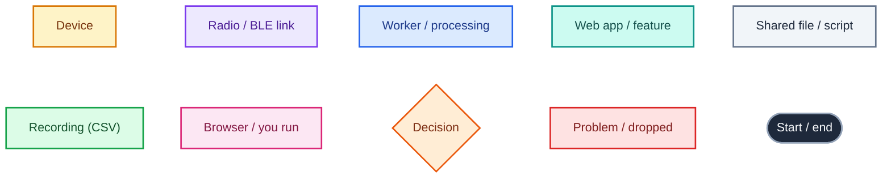
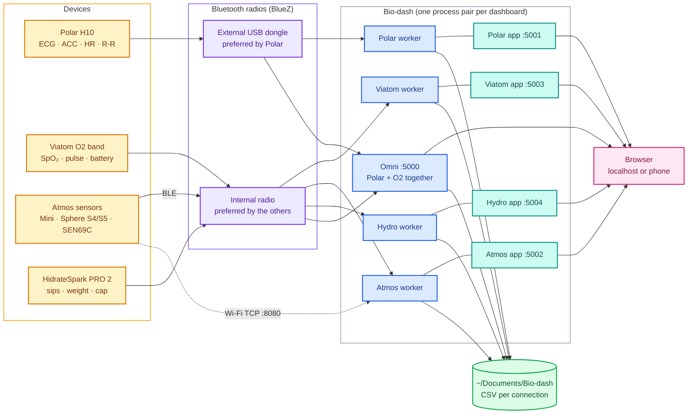
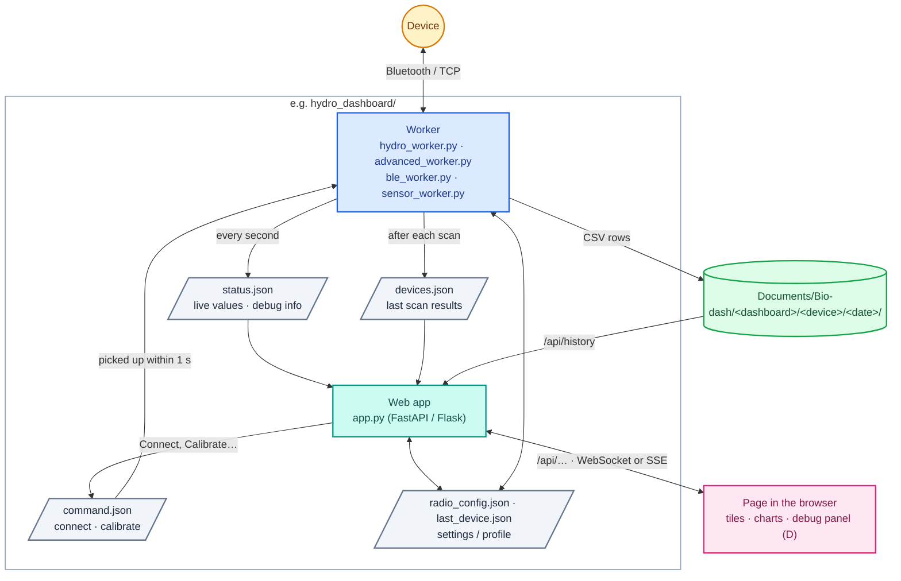
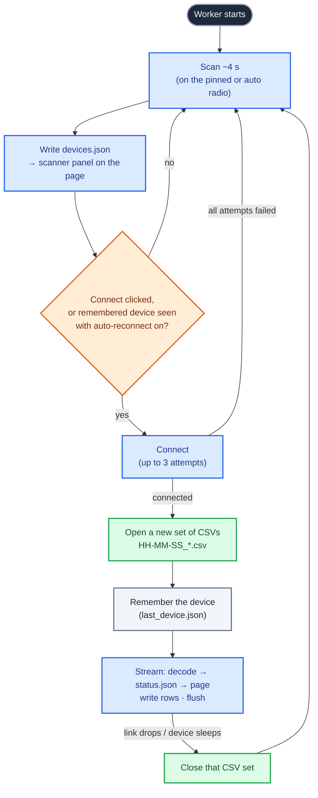
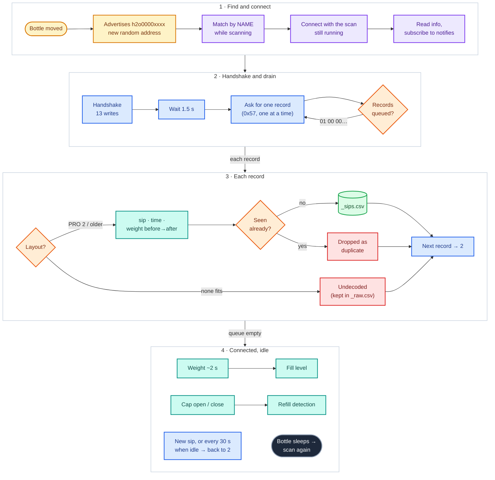
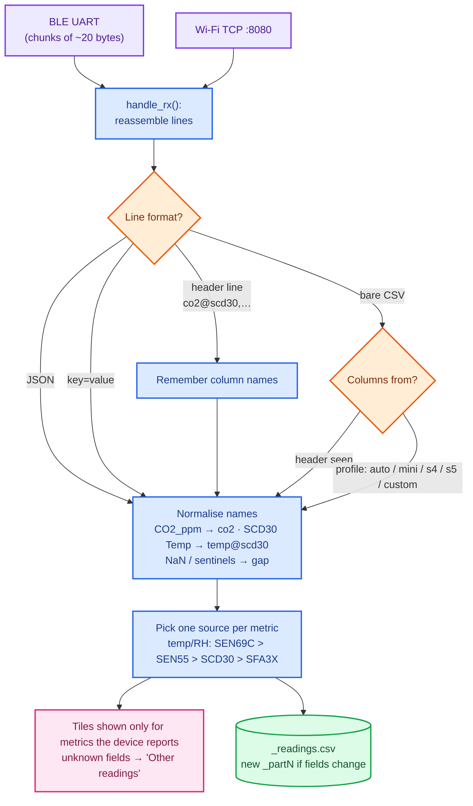
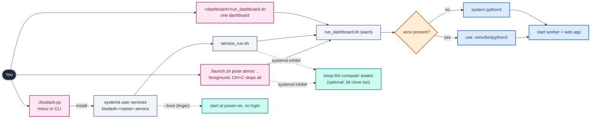

# How Bio-dash works

Flow diagrams for the whole suite, from the devices to the files on disk. GitHub renders the
diagrams below; elsewhere, paste a block into <https://mermaid.live>.

1. [The big picture](#1-the-big-picture) — devices, radios, workers, web apps, recordings
2. [Inside one dashboard](#2-inside-one-dashboard) — how a worker and its web app talk
3. [A device's life cycle](#3-a-devices-life-cycle) — scan, connect, record, reconnect
4. [Hydro-dash: the bottle protocol](#4-hydro-dash-the-bottle-protocol)
5. [Atmos: from any sensor format to tiles](#5-atmos-from-any-sensor-format-to-tiles)
6. [Starting and running everything](#6-starting-and-running-everything)

**Colour key** (same in every diagram):

---

## 1. The big picture

Each device has its own dashboard: a **worker** that talks Bluetooth (or Wi-Fi) and records, and
a **web app** that serves the page. Omni runs both body sensors in one process.

- **Radio routing:** each dashboard picks a radio by its *address* (stable across reboots) from
  `radio_config.json`, or automatically: Polar prefers the external dongle, the rest the internal radio.
- **Omni and the standalone Polar / Viatom dashboards are alternatives** — both would try to own
  the same devices (`biodash.py` won't install them together).

---

## 2. Inside one dashboard

The worker and the web app are separate processes that share a few small files, so either can
restart without taking the other down.

- **Live data:** Polar and Atmos push over a WebSocket, Viatom and Omni over Server-Sent Events,
  Hydro-dash polls (its data changes a few times an hour).
- **History:** tile trends and Hydro-dash's totals are read back from the CSV recordings, so they
  survive restarts.
- **Shared code** (identical copies in every dashboard): `bt_debug.py` (radios, auto-reconnect,
  recordings, shutdown/reboot) and the page scripts `nav.js`, `tile_trends.js`, `reconnect.js`, `power.js`.

---

## 3. A device's life cycle

The same loop in every worker. Hydro-dash's connect step differs; see section 4.

- **One CSV set per connection.** A dropout ends the set; the reconnect starts a new one in the
  same date folder. Timestamps are absolute, so sets line up.
- **Auto-reconnect** can be paused or forgotten from the reconnect bar on each page
  (`BIODASH_AUTORECONNECT=0` turns it off by default).

---

## 4. Hydro-dash: the bottle protocol

The PRO 2 sleeps, advertises only briefly after being moved, **changes its address each wake-up**,
and is dropped by BlueZ the moment scanning stops — hence the unusual connect step.

- **Totals, charts, "today"** are computed from `_sips.csv` across all sessions, so replayed sips
  land on the right day and nothing double-counts.
- **Everything raw** goes to `_raw.csv` (every notification, hex) — the basis for decoding new firmware.
- Protocol details and sources: `hydro_dashboard/PROTOCOL.md`.

---

## 5. Atmos: from any sensor format to tiles

One parser handles every Atmos board, over Bluetooth (Nordic UART) or Wi-Fi (TCP).

- The firmware for the S4 and SEN69C boards sends a **header line** first, so columns are mapped
  by name and no profile guessing is needed.

---

## 6. Starting and running everything

- **`./setup_env.sh`** creates the `.venv` once; everything else uses it automatically.
- **Service options** (`biodash.py`): keep awake, lid close, auto-reconnect, shutdown/reboot from
  other devices, start at boot.
- **On the page:** ☀ *Keep screen on* (localhost or HTTPS), 🐞 debug panel with the System card
  (shutdown / reboot), header links between dashboards.
