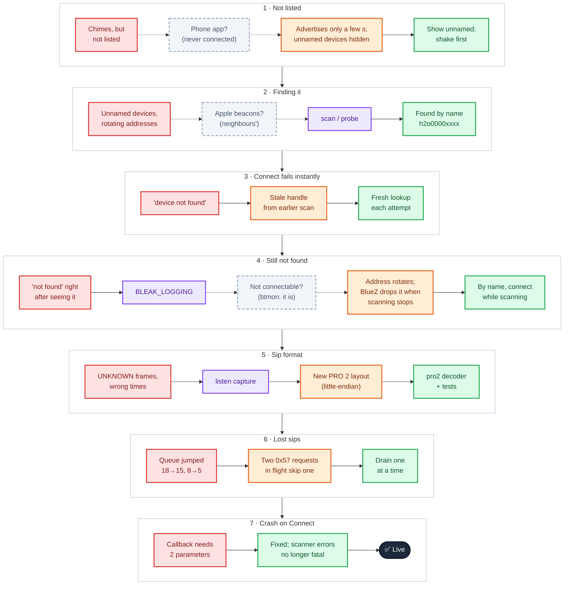
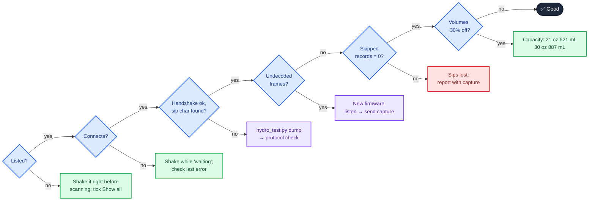

# HidrateSpark PRO 2 — how we got it working

A record of bringing up Hydro-dash on a real **HidrateSpark PRO 2** (21 oz, firmware 100.64.0,
hardware "Sensor-SM-V1"), on 2026-10-06, on a Framework 13 (Ubuntu, BlueZ, bleak 3.0.2).
Hydro-dash had been built from community documentation for the original PRO; this is everything
that went wrong between that and a working dashboard, and why.

Real Bluetooth addresses and the bottle's serial number are replaced with placeholders below.

**Quick fixes, if you're here because it isn't working:** see the [checklist](#checklist) at the end.


## The investigation at a glance

🟥 symptom · ⬜ (dashed) wrong guess · 🟪 tool that showed it · 🟧 real cause · 🟩 fix · ⬛ result



## If it isn't working



---

## Timeline

### 1. The bottle didn't appear in Hydro-dash

**Symptom:** the bottle chimed, but Hydro-dash's scanner never listed it.

**Causes (on our side — the bottle was never connected to a phone):**
- The bottle **only advertises for a few seconds after it's moved**, then goes quiet. Hydro-dash
  scanned in ~4 s windows, so it often missed that burst.
- The scanner **skipped every device without a name**. Unnamed advertisements weren't even shown
  under *Show all*, so there was nothing to spot.

**Fixes:**
- Unnamed devices are now listed under *Show all nearby devices*, with their service and
  manufacturer IDs.
- **Shake or tip the bottle right before / during a scan**, and keep it next to the computer.

### 2. Finding the bottle among dozens of devices

`hydro_test.py scan` showed six strong **unnamed devices that advertised nothing at all**, and a
few weak Apple (`004c`) beacons.

- **Red herring:** the weak Apple beacons (−92 to −100 dBm). A bottle next to the laptop reads
  −30 to −60 dBm; these were neighbours' AirTags / iPhones, not the bottle's Find My signal.
- The strong unnamed devices had **different addresses on every scan** (private, rotating
  addresses), so "scan, then dump the strongest" kept chasing moving targets.
- Added `hydro_test.py probe`: connects briefly to each strong unnamed device right after the scan
  and checks for HidrateSpark's services.

Woken right before the scan, the bottle then showed up properly under its name, **`h2o0000xxxx`**,
recognised as a HidrateSpark, at −57 dBm. (Its advertisement carries only the name, which is why it
looked like nothing at all whenever the name wasn't captured.)

### 3. "device … not found" — instantly

**Symptom:** clicking **Connect** failed three times within seconds:
`BleakError("device 'dev_XX_XX_XX_XX_XX_XX' not found")`.

**Cause (first layer):** the worker connected using the device handle from its *earlier* scan.
The bottle only advertises for a few seconds after it's moved, and BlueZ forgets devices it hasn't
seen recently, so the handle was stale.

**Fix:** look the bottle up fresh before every connection attempt. The page now shows *"waiting
for the bottle to advertise — shake or tip it"*, and the debug panel shows the last connection error.

### 4. Still "not found" — and the address keeps changing

**Symptom:** the fresh lookup *found* the bottle, but the connection still failed with
`device … not found`.

**Discovery 1 — the address rotates on every wake-up.** Over one afternoon the bottle used at least
four different addresses. They're *static random* addresses that change each time it wakes (it's an
Apple Find My accessory). Connecting by address is a race you lose; **the name (`h2o0000xxxx`) is
the only stable handle**.

**Discovery 2 — `bluetoothctl` by hand is too slow.** `scan le` showed the bottle, but by the time
`connect` ran in a second terminal it said `Device … not available`, and the scan showed
`[DEL] Device … h2o0000xxxx`: BlueZ had already dropped it.

**Fix:** `hydro_test.py dump <name>` waits for the name to advertise and connects immediately.

### 5. The real cause: BlueZ drops the bottle when scanning stops

`BLEAK_LOGGING=1` gave the timing:

```
09.007  Discovering: False                          ← scan stops, bottle just seen
09.009  Connecting to device @ XX:XX:XX:XX:XX:XX
09.015  device 'dev_XX_…' not found                 ← 6 ms later, before any connection attempt
```

**Wrong turns:** early on we wrongly blamed the phone app for holding the connection (it never
was connected). Here, we first concluded the bottle was *non-connectable* (BlueZ drops non-connectable
devices fast). `sudo btmon` disproved it:

```
Legacy PDU Type: ADV_IND (0x0013)          ← connectable
Address: XX:XX:XX:XX:XX:XX (Static)
Name (complete): h2o0000xxxx               ← the advert carries only the name
```

So the bottle **is connectable**; BlueZ simply removes it the instant discovery stops — and bleak's
normal sequence is *find → stop scanning → connect*.

**Fix:** **connect while the scan is still running**, and stop scanning once the link is up.
First successful connection:

```
seen at XX:XX:XX:XX:XX:XX -- connecting with the scan still running
✅ Connected.
```

### 6. What the PRO 2 exposes

`hydro_test.py dump h2o0000xxxx` listed every service. Everything Hydro-dash needs is there:

| Needed | Found |
|---|---|
| Handshake `b44b03f0-…` and sip records `016e11b1-…` | ✅ in the HidrateSpark service `45855422-…` |
| Cap state `e3578b0d-…` | ✅ (moved to its own service `593f756e-…`, same characteristic) |
| Weight `1807a063-…` | ✅ plus a new `2007a063-…` next to it |
| Battery, firmware, serial, model | ✅ 100 %, 100.64.0, "HidrateSpark PRO 2" |

New on the PRO 2: Apple **Find My** (`fd44` service, `4f86000x-…` characteristics), a
**bottle-settings** characteristic `316c4914-…` (`6d02` = 621 = capacity in mL, little-endian),
and several vendor services (OTA, device info).

### 7. Sip records in an unknown format

**Symptom:** `hydro_test.py listen` drained the 19 sips stored on the bottle, but most showed
`⚠ sip frame in an UNKNOWN layout`, and the few that "decoded" had **wrong times**.

**Cause:** the PRO 2 uses a new, little-endian record layout. Decoded from the capture:

| Bytes | Meaning | How we checked |
|---|---|---|
| 0 | records still queued | counts down 19 → 1 |
| 1 | sip, % of capacity | 17 % → 106 mL; 3 % → 19 mL |
| 2–3 | today's running total, % | 102 → 109 = +7 ✓ each step; resets overnight |
| 4–7 | seconds since the sip | the live sip read "1 s ago" |
| 12–15 | weight before → after | each "after" = the next "before"; ≈ 0.38 mL per unit |

**Fix:** a `pro2` layout in `hydro_protocol.py`, with tests built from the captured frames.
Details in [PROTOCOL.md](PROTOCOL.md).

### 8. Skipped sip records

**Symptom:** the queued count jumped **18 → 15** and **8 → 5**, so four sips were lost.

**Cause:** each `0x57` drain request *acknowledges* the current record. Two requests in flight (the
bottle starting on its own after the handshake, plus our request, plus a retry fallback) skip one.

**Fix:** drain **strictly one request at a time** (the next only after a record arrives or 2 s pass),
wait 1.5 s after the handshake in case the bottle starts by itself, never re-check mid-queue, and
count any skips (*Skipped records* in the debug panel).

### 9. The worker crashed on Connect

**Symptom:** `TypeError: callback must be callable with 2 parameters`.

**Cause:** bleak requires the scan callback to take exactly `(device, advertisement)`; ours had a
third, defaulted parameter. The scanner was also created outside the error handling, so the error
killed the whole worker.

**Fix:** a two-parameter callback; scanner errors now count as a failed attempt instead of crashing.
(The simulated scanner used in testing now enforces bleak's rule too.)

### 10. Working

Hydro-dash connected to the bottle by name, showed the serial and firmware, today's sips and total,
the last sip "just now", and battery 100 %. Remaining setup: fill-level calibration and checking the
bottle size (21 oz = 621 mL vs. the 30 oz tumbler = 887 mL; sips are a % of capacity).

### 11. A day later: "can't find it" again, and it was the laptop's radio

**Symptom:** after the bottle ran flat and was recharged, scans showed only unnamed devices, the
occasional sighting was followed by a connection timeout, and the system's own scanner caught the
name only now and then. A raw capture showed the bottle advertising normally (`ADV_IND`, its name,
a new address).

**Cause:** the laptop's built-in radio. It shares a chip and antenna with Wi-Fi and simply wasn't
listening often enough to catch the bottle's adverts. An old USB Bluetooth dongle picked the bottle
up almost instantly.

**Fix:** use a USB dongle for the bottle. Hydro-dash now prefers an external radio automatically
when one is plugged in (pin it under *Radio for this dashboard* in the debug panel if you have
several); for the test script, `--adapter hci1`. `python3 hydro_test.py watch` prints one mark per
second showing when the bottle was actually heard, which makes a deaf radio obvious.

**Wrong turns:** suspecting the charge, the phone, a Find My-only mode, and the new V3.1 code. The
connection code hadn't changed.

---

### 12. Connected, but no services: an old dongle and big replies

The USB dongle from step 11 heard the bottle instantly, and then "connected" with an empty service
list: firmware unknown, 0 notifying characteristics. `btmon` showed why. The computer asks the
bottle for a larger message size (the bottle agrees to 200 bytes), then asks for its
characteristics. The bottle answers the small replies, and never sends the first large one
(about 190 bytes). 30 s later the computer gives up. The link itself stays healthy throughout.

The dongle was Bluetooth 4.0: 27 bytes per radio packet, so a large reply has to be cut into many
pieces, and this bottle doesn't manage that. A radio that carries long packets whole (the laptop's
built-in one, or a Bluetooth 5 dongle) doesn't hit it.

How it was pinned down:

- `gatttool -i hci0 -t random -b <addr> --characteristics` listed everything. It never asks for the
  larger size, so every reply is small.
- Capping the size system-wide made the dashboard's own connection work on the old dongle:
  in `/etc/bluetooth/main.conf` add `[GATT]` / `ExchangeMTU = 64`, then restart bluetooth.
  (Not 23: bluetoothd then fails to register any adapter.) This applies to **every** device on
  the machine, and the Polar H10 wants the larger size, so it's a diagnostic more than a fix.

Also learned: the bottle's address changes from time to time. Each change makes the computer read
the service list afresh, so a setup that "worked this morning" from a remembered list can stop.
Always find the bottle by name, never by a saved address.

Because of this, Hydro-dash no longer picks a dongle automatically. Choose the radio in the debug
menu: a Bluetooth 5 dongle is the best of both; an old one needs the cap above.

## Checklist

| Symptom | Check |
|---|---|
| Bottle not listed | Shake or tip the bottle right before / during the scan (it only advertises briefly); keep it within ~1 m; tick *Show all nearby devices* |
| Bottle rarely seen, or seen but the connection times out | The radio isn't hearing it. Plug in a USB Bluetooth dongle and select it in the debug panel; check with `python3 hydro_test.py watch --adapter hci1` |
| `device … not found` | Use the current Hydro-dash (it follows the bottle by name and connects while scanning) |
| Connects, but no sips | Debug panel: *Sync after connecting* = complete, *Sip records via* found; *Undecoded sip frames* rising → new firmware layout, send `_raw.csv` |
| Sips missing | Debug panel: *Skipped records* should be 0 |
| Volumes look ~30 % off | Capacity setting vs. your bottle (21 oz 621 mL, 30 oz tumbler 887 mL) — in the HidrateSpark app *and* Hydro-dash |
| Anything else | `python3 hydro_test.py listen h2o0000xxxx` prints every notification decoded and saves a capture |

## Tools that helped

| Tool | Used for |
|---|---|
| `hydro_test.py scan` / `probe` / `dump <name>` / `listen <name>` | finding, inspecting and capturing the bottle without the dashboard |
| `bluetoothctl --timeout 60 scan le \| grep -i h2o` | seeing the bottle appear (`[NEW]`) and be dropped (`[DEL]`) |
| `BLEAK_LOGGING=1 …` | the millisecond timing that showed BlueZ dropping the device |
| `sudo btmon \| grep -B16 h2o \| grep -iE "PDU\|Address\|Name"` | the advertisement type (connectable or not) and address type |
| Hydro-dash debug panel (D) | handshake, frames, skips, last error, every characteristic's last raw frame |
