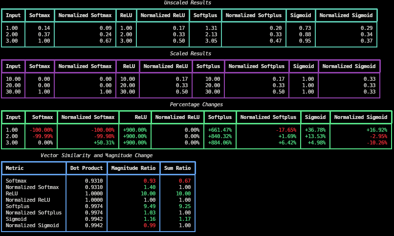

# Softmax Comparison

This script evaluates different softmax alternatives for how resistant they are
to softmax collapse (where scaling causes a value to collapse to a single
entry), as well as general distribution shifts (measured by dot product), as
well as overall magnitude changes for the output softmax vectors.

## Usage

```python
python3 softmax_comparison.py 1 2 3
```

## Example Image

Then results for softmaxes of 1 2 3 and scaled (10 20 30) are shown and compared.




## TODO

Obo_1 and Obo_10 are shown above, currently due to the framemwork these are
mapped to:

- obo_values - obo_1 - obo with constant of 1
- obo_normalized - obo 10 - obo with a constant of 10

## Notes

- ReLU with normalization is resistant to softmax collapse
- When all inputs are scaled, Sigmoid becomes less certian (*opposite of softmax
  collapse)
- Normlaized softlpus is more resistant to softmax collaps when scaling, likely
  due to approximating ReLU, while having the advantages of having non-zero
  signals  for x<0.
- ReLU, being linear, scales linearly for all x > 0.
- Obo is somewhat resistant to softmax collapse, but only in that the largest value is not as magnified (smaller values are still attenuated).
- For larger constants, increasing the values of the inputs results only in
  attenuation of the smaller values, and no magnification of the larger values.
