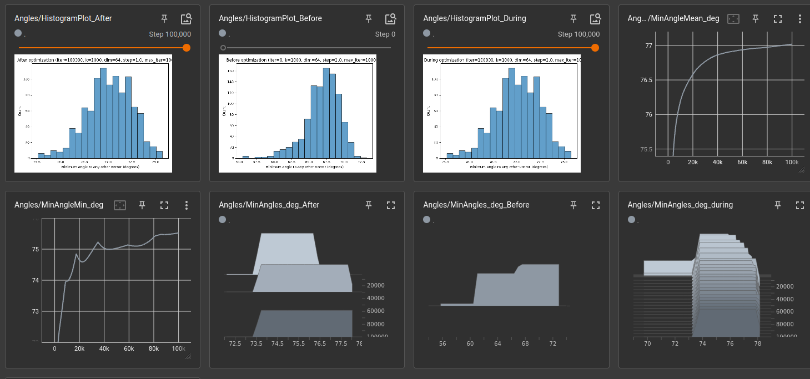

# Sphere Packing on an \(n\)-Sphere with Shadow Vectors and TensorBoard

This repository contains a Python script (`hypersphere_shadow_packing.py`) that:
1. Places \(k\) “main” vectors on an \((n-1)\)-dimensional sphere (in \(\mathbb{R}^n\)) **plus** a “shadow” vector \(-x\) for each main vector.
2. Minimizes a **Riesz (Coulomb‐like) potential** \(\sum_{i<j} 1 / \|x_i - x_j\|\) among **all** points \(\{x_i, -x_i\}\).
3. Uses **PyTorch** for gradient-based optimization with either **SGD** or **Adam**.
4. Optionally uses a **cosine decay** schedule for the learning rate.
5. Logs key metrics (energy, minimum angles, learning rates) to **TensorBoard**.
6. Periodically saves histograms of the **minimum angles** between the main vectors, both as `.png` files and as images/histograms directly to TensorBoard.



---

## Features

- **Shadow vectors**: every main vector \(x\) has a partner \(-x\), also on the sphere.
- **Riesz potential** (\(1/r\)) for pairwise distances among \(\{x_i, -x_i\}\).
- **Projection** to sphere after each gradient step ensures vectors remain unit.
- **Gradient-based**: user chooses `--optimizer` (either `SGD` or `Adam`).
- **Cosine decay**: optional via `--lr-min`.
- **TensorBoard logs**:
  - Energy
  - Per-vector **minimum angle** distribution
  - Learning rate
  - Histograms of angles
  - Saved *matplotlib figures* directly embedded in TensorBoard
- **Local .png** plots**: “before optimization,” “after optimization,” and optionally during optimization (interval set by `--plot-every`).

---

## Requirements

- Python >= 3.7
- [PyTorch](https://pytorch.org/) >= 1.0
- [matplotlib](https://matplotlib.org/)
- [tensorboard](https://pypi.org/project/tensorboard/) for logging and visualization

Example installation:
```bash
pip install torch matplotlib tensorboard
```

---

## Usage

1. **Clone** or copy the script into a file, e.g. `hypersphere_shadow_packing.py`.
2. **Run** from the command line:
   ```bash
   python hypersphere_shadow_packing.py \
     --dim 3 \
     --k 5 \
     --max-iter 1000 \
     --step-size 0.01 \
     --optimizer Adam \
     --lr-min 1e-5 \
     --plot-every 500 \
     --logdir my_logs
   ```
   The script will:
   - Initialize 5 vectors in \(\mathbb{R}^3\).
   - Create shadow vectors.
   - Optimize the Riesz potential for 1000 steps.
   - Save logs to `my_logs/`.
   - Generate angle-histogram `.png` files at the start, every 500 steps, and after completion.

3. **View** logs in TensorBoard:
   ```bash
   tensorboard --logdir my_logs
   ```
   Then open the given URL in a web browser. You can see scalars, histograms, and embedded images of angle distributions.

---

## Command-Line Options

```text
usage: hypersphere_shadow_packing.py [-h] [--dim DIM] [--k K]
                                 [--outfile OUTFILE] [--max-iter MAX_ITER]
                                 [--step-size STEP_SIZE]
                                 [--optimizer {SGD,Adam}]
                                 [--lr-min LR_MIN] [--lr-tmax LR_TMAX]
                                 [--seed SEED]
                                 [--before-plotfile BEFORE_PLOTFILE]
                                 [--after-plotfile AFTER_PLOTFILE]
                                 [--logdir LOGDIR] [--plot-every PLOT_EVERY]

Pack k points on an n-dimensional sphere (with shadows) using Riesz energy,
TensorBoard logs, optional Adam & LR decay.

optional arguments:
  -h, --help            show this help message and exit
  --dim DIM             Dimension n of the hypersphere (points in R^n).
  --k K                 Number of main vectors (2k total with shadows).
  --outfile OUTFILE     Output .npy filename for main vectors after training.
  --max-iter MAX_ITER   Number of gradient steps.
  --step-size STEP_SIZE Initial learning rate.
  --optimizer {SGD,Adam}
                        Optimizer choice.
  --lr-min LR_MIN       If set, use CosineAnnealingLR down to this min LR.
                        If not set, no LR scheduler.
  --lr-tmax LR_TMAX     T_max for the cosine decay (defaults to max_iter if used).
  --seed SEED           Random seed.
  --before-plotfile BEFORE_PLOTFILE
                        Histogram plot file (before optimization).
  --after-plotfile AFTER_PLOTFILE
                        Histogram plot file (after optimization).
  --logdir LOGDIR       Directory for TensorBoard logs.
  --plot-every PLOT_EVERY
                        Interval (iterations) between saving angle histogram
                        plots. (0=never)
```

