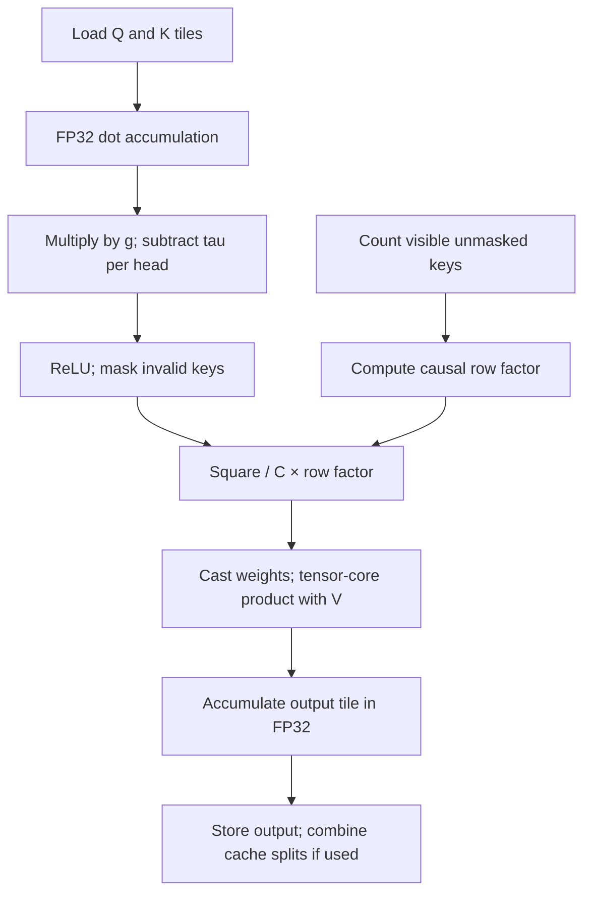

# Learned subtractive bias and causal length scaling

The rules target two different possible causes of the long-context convergence:
weak positive matches accumulating as more keys become visible, and growth in the
unnormalized attention branch's magnitude. Diagnostics must establish whether these
occur in the trained models; the experiment does not assume either explains the loss curves.

## Definition

Let `r = Q @ K.T`, `g` be the layer's learned QK scale, `tau[h]` the head bias,
`C=256`, and `n[b,i]` the count of unmasked keys that satisfy `j <= i + causal_offset`.
With `A=512` and fixed exponent `alpha`:

```python
s = g * r - tau[h]             # tau absent means exactly zero
p = max(s, 0)
c = max(1, n[b, i] / A) ** -alpha
w = allowed * c * p * p / C
O = w @ V
```

Q and K are L2-normalized after RoPE in the model; `tau` has the units of the **scaled**
QK score. It is shared across batch and positions, not across heads or layers. It is
an unconstrained signed parameter initialized at zero. No softplus or clamp blocks its
initial gradient. Auxiliary AdamW updates it without weight decay.

Scaling is a multiplier on **post-activation weights**, not on the logits. If a query
has at most 512 visible keys, `c=1`. Beyond the anchor, alpha=1/2 counteracts the
square-root growth expected from a sum of approximately uncorrelated value contributions;
alpha=1 counteracts linear growth of row mass. These are experimental motivations, not
assumptions that real value vectors are independent or zero-mean. Scaling alone cannot
change a row's relative weights or its effective key count. Bias can change both.

## Fused forward



The loop never stores an N×N score tensor. Unmasked counts are calculated inside the
kernel from query position and cache offset. Masked counts come from one integer
prefix scan per batch, of shape `[B,N]`. The scale exponent and anchor are compile-time
constants; the learned bias and QK scale are runtime tensor loads.

Masking follows the bias subtraction so a negative bias cannot reactivate a masked
entry. A fully masked row returns zero. Counts do not look at future padding or use
the number of queries in the current chunk. The default offset is `N-M`, giving the
usual bottom-right alignment when a short query chunk attends to cached keys.

## Backward, step by step

For upstream `dO`, recompute the same scores and mask tile:

```python
dW = dO @ V.T
dS = allowed * dW * (2 / C) * relu(g * r - tau[h]) * c
dQ = (dS @ K) * g
dK = (dS.T @ Q) * g
dV = W.T @ dO
dg = sum(dS * r)
dtau[h] = -sum_over_batch_and_query_and_key(dS[..., h, :, :])
```

The minus sign is essential: increasing a subtractive bias reduces positive scores.
Do not multiply `dtau` by `g`; the subtraction is **after** score scaling. At `g=0`,
`dQ` and `dK` can vanish while `dg` and `dtau` remain nonzero when `tau<0`.
The non-trainable causal count/anchor/exponent need no gradient.

One kernel processes query tiles for dQ, dg and dtau. Per-row FP32 partials for the two
learned parameters are reduced afterward; no gradient atomic accumulation is needed.
A second kernel processes key tiles for dK/dV. Split-cache inference combines FP32
output partials. Intermediate weights/score derivatives use the input matmul dtype,
so BF16 results have rounding differences from the independent FP32 reference.
Higher-order gradients and attention dropout are outside this fast path's contract.

## Code map

| File / function | Inspect this step |
|---|---|
| `hf_model/context_attention.py::context_attention_reference` | Independent explicit attention math and autograd reference |
| `hf_model/context_attention.py::visible_counts` | Causal, padding and cache count semantics |
| `hf_model/triton_context_attention.py::_length_factor` | In-kernel causal scaling |
| `hf_model/triton_context_attention.py::_row_tiles` | Fused forward, dQ, scale gradient and negative bias gradient |
| `hf_model/triton_context_attention.py::_kv_tiles` | Recompute weights and derivatives for dK/dV |
| `hf_model/triton_context_attention.py::_TritonContextAttention` | Autograd saves, launch choices and parameter-gradient reductions |
| `hf_model/modeling_comparison.py::ComparisonAttention` | Create bias parameters and dispatch the new arms |
| `hf_model/configuration_comparison.py::ComparisonConfig` | Persist treatment and reject contradictory variant/config labels |
| `experiment/optimizers.py::partition` | Muon matrix ownership; scalars/biases in auxiliary AdamW |
| `experiment/train.py::validation_suite` | Record bias and scale by layer at every validation |
| `diagnostics/probe_context.py::weight_statistics` | Reconstruct selected causal rows for learned-model diagnostics |

## Specific tests included

| Feature | Independent CPU checks | Actual Triton checks |
|---|---|---|
| Per-head bias | Closed-form sign and head independence; FP64 finite-difference gradients for Q/K/V/g/tau; zero initialization; Muon exclusion and AdamW update | Forward plus all five gradients; positive, negative and zero scales; signed biases; bias-only backward |
| Causal length scaling | Exact anchor/1024/2048 factors; mask prefix counts; prefix invariance; cached chunks; all-masked rows | alpha=0,1/2,1; masked/unmasked cases; short queries; split-cache reduction; negative offset; noncausal interpreter branch |
| Combined model | HF save/load and config validation; checkpoint recomputation; exact resumed optimizer/model state in both norm modes | BF16 fused HF forward/backward and Muon updates for each new arm with both norm modes |
| Diagnostics | Treatment-aware row statistics; no weight mutations; same held-out target prefix; recovery of truncated outputs | Runs against the real fused model on the user's GPU |

`tests/test_context_attention.py` contains the CPU math/model tests.
`tests/test_context_cuda.py` contains GPU correctness/model-update tests.
`tests/test_context_pipeline.py` tests actual training resume and diagnostic recovery.
`scripts/check_context_kernels.py` executes actual tiles in the Triton interpreter and
compiles head-128 masked-prefill and unmasked-decode branches for SM80/89/90.

The GPU suite uses both elementwise tolerances and an aggregate RMS error limit for
BF16; failures stop `run.sh all` before expensive training. Interpreter/compilation
success is not a substitute for CUDA execution. No throughput result is inferred
from any of these correctness checks.
