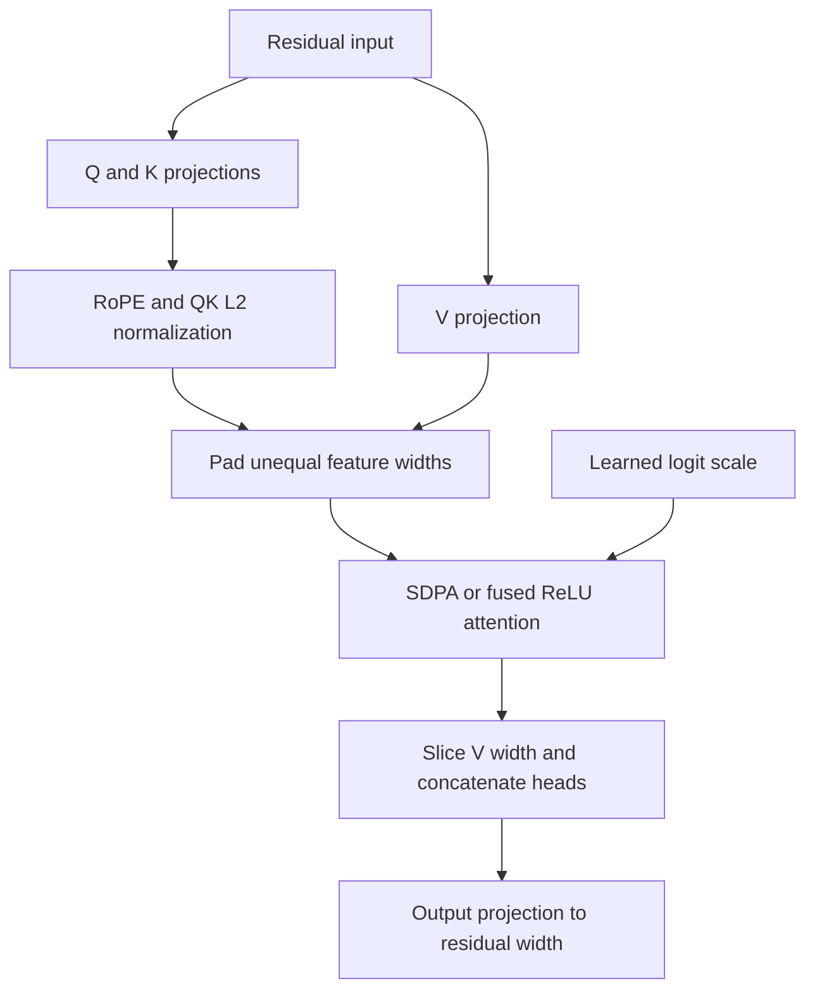

# Hugging Face and fused attention adaptation

This package adds separate search modules to the established lab. The original
model, kernels and training entry points are preserved. Use a fresh extraction
and fresh run directory: the source fingerprints of this extended package differ
from earlier releases, even though their individual baseline files are unchanged.

## Architecture contract

Let residual width be `d`, heads `H`, QK head width `Dq`, and V head width `Dv`.
The new `SearchConfig` / `SearchForCausalLM` use these projection weight shapes:

| Weight | PyTorch shape |
|---|---|
| Q, K | `(H*Dq, d)` each |
| V | `(H*Dv, d)` |
| Output | `(d, H*Dv)` |

Thus `d=512, H=3, Dq=128, Dv=64` is valid. The residual stream stays 512-wide,
Q/K projections are 384-wide, and the V/output input is 192-wide. No division of
`d` by `H` is required. The first implementation uses concatenated full heads;
summed heads, GQA and per-layer heterogeneous dimensions are future extensions.



The existing QK normalization is L2 normalization per head, with its original
epsilon placement; it is distinct from the RMSNorm on residual blocks. RoPE
acts on actual QK channels before padding. The learned scalar `g` is per layer,
shared by its heads, and remains differentiable in all three arms. Scores are
`g * dot(q,k)`. SDPA receives `q*g` and `scale=1.0` to avoid an extra hidden
dimension scale. Existing masks and bottom-right-aligned KV-cache decoding are
preserved. The cache stores actual QK/V widths.

ReLU weights remain **unnormalized**: `relu(s)^2 / divisor`. Linear16 uses
`s^2` on `(0,16]`, `32*s-256` above 16, and zero below zero, then the same
divisor. The value and derivative agree at the transition. Softmax is a different
attention rule and a quality/performance comparison, not an accuracy reference
for these activations.

## Equal-width fast path and unequal-width bridge

The existing tiled forward/backward kernels are unchanged. They expect one
shared feature width. When `Dq != Dv`, the adapter pads Q/K/V to `max(Dq,Dv)`,
runs the same fused operator, and slices the output to `Dv`. The padding is
differentiable and leaves the mathematical QK dot products and weighted V sums
unchanged. Floating-point implementations still need tolerance-aware checking.

This is **not a native asymmetric-width kernel**. Extra padding allocations,
memory traffic, and arithmetic can reduce speed. Results label the path
`triton_fused_padded` or `sdpa_flash_padded`; equal widths retain the direct path.
Triton also rounds tile width internally to a power of two, which the search
planner records separately from the logical widths. No speedup is claimed for
the adapter without a GPU run. Both widths are limited to 256 by the reused
kernels. The search presets use even QK dimensions for full-width RoPE; the model
also accepts odd QK dimensions with an explicitly even partial `rope_length`.

## Optimizer routing

| Parameters | Optimizer | Default decay | Default LR |
|---|---|---:|---:|
| Decoder attention and FFN matrix weights | Muon | 0.0 | 0.02 |
| Token embeddings and LM-head matrices | AdamW | 0.1 | 0.0006 |
| RMSNorm gains, QK logit scales, biases, other scalar/vector parameters | AdamW | 0.0 | 0.0006 |

Muon applies to eligible hidden matrices, not literally every tensor in a decoder.
Tied WTE/LM-head weights are assigned once. Module ownership and parameter identity
drive routing; every trainable tensor must be covered exactly once. Each run saves
`optimizer_groups.json`, including names, shapes, learning rates and decay.
Muon decay zero is the requested experiment setting, not a claim of a universally
optimal Muon convention. Both learning rates are explicit search dimensions.

## HF API usage

Use the package's pinned environment (Transformers 4.44.2, PyTorch 2.9.1).
This intentionally avoids the newer `_tied_weights_keys` API mismatch encountered
in an earlier user environment. Supporting a new Transformers major version is
a separate compatibility gate, not an untested dependency upgrade.

```python
from hf_model.configuration_search import SearchConfig
from hf_model.modeling_search import SearchForCausalLM

config = SearchConfig(
    hidden_size=512, intermediate_size=2048, num_hidden_layers=16,
    num_attention_heads=3, n_qk_head_dim=128, n_v_head_dim=64,
    variant="linear16", use_qk_norm=True, use_qk_norm_scale=True,
    qk_norm_scale_init=20.0, use_rotary_embeddings=True,
    sdpa_backend="flash", require_fused=True,
)
model = SearchForCausalLM(config)
model.save_pretrained("my_model")
restored = SearchForCausalLM.from_pretrained("my_model")
```

For exported checkpoints, local `AutoConfig` / `AutoModelForCausalLM` loading with
`trust_remote_code=True` uses the included custom model source. Generation and
KV caches follow the model's HF interface. Training uses BF16 autocast on CUDA;
the master parameters stay FP32 as in the previous comparison.
All-ones tokenizer masks are reduced to the compact causal Flash path. Genuinely
padded CUDA batches with forced `sdpa_backend="flash"` fail explicitly; choose
`"auto"` for such inference batches. Search training uses packed, unpadded streams
and requires Flash rather than silently benchmarking a different softmax backend.

The production CLI runner retains the lab's chunked LM-head loss, exact token
cursor, atomic checkpoints, and both optimizer states. An additional
`hf_search.hf_trainer.MuonTrainer` subclasses HF `Trainer.create_optimizer` and
exposes both native optimizers through a scheduler-compatible adapter. It builds
the optimizer after `model_init` and device placement, which is necessary for HF
HPO. A recipe can be a dict or `callable(model.config)` to select trial-specific
learning rates. For example:

```python
from hf_search.hf_trainer import MuonTrainer
# recipe is configs/hf_search_100m.json's base.optimizer_recipes.muon.
trainer = MuonTrainer(
    model_init=lambda: SearchForCausalLM(config),
    muon_recipe=recipe,
    args=training_args,
    train_dataset=train_dataset,
    eval_dataset=eval_dataset,
)
```

Do not pass a prebuilt optimizer alongside `model_init`. The bridge was tested
with a real two-step Trainer run, scheduler propagation, and exact optimizer
state restoration. Standard HF Trainer's full-vocabulary loss and dataset
semantics are not automatically equivalent in VRAM or token accounting to the
production CLI. Full HF Trainer checkpoint/resume, distributed training,
DeepSpeed/FSDP and newer Transformers versions are not validated in this release.

## Feature priorities after this release

1. **Native separate-Dq/Dv kernels.** Size QK and V tiles independently in forward,
   backward and decode. Benchmark end-to-end, including padding cost, optimizer
   time and the output projection. Retain the padded bridge as an oracle/compatibility
   path and label both implementations.
2. **Dimension-aware scale diagnostics.** Under an independent isotropic unit-vector
   approximation, `Var(dot(q,k)) = 1/Dq`; therefore logit variance is `g^2/Dq`.
   Holding `g=20` while changing `Dq` also changes attention scale and linear16 tail
   occupancy. Record learned `g`, positive-score fraction, fraction above 16,
   row weight mass versus causal position, and gradient norms. Compare fixed-g
   against an explicit `g_init = 20*sqrt(Dq/128)` treatment; do not silently change
   initialization. This approximation is a diagnostic hypothesis, not a claim
   about trained attention distributions. With normalized Q/K, scores cannot
   exceed `abs(g)`. If `abs(g)<=16`, the linear16 tail cannot activate; at `g=20`
   it requires a QK cosine above 0.8. Tail-occupancy measurements therefore matter
   when interpreting nearly identical ReLU²/linear16 validation results.
3. **Paired seeds and Pareto reporting.** Compare equal-budget runs within the
   same dataset/tokenizer/context cohort. Report final loss as well as best loss
   on a fixed evaluation cadence. Shortlist on loss, tokens/s, VRAM and parameter
   count; confirm promising candidates with multiple matched seeds. Native-context
   and common-context validation answer different questions and should both remain.
4. **Search strategies behind one trial contract.** Add Optuna/Vizier or repaired
   greedy growth using versioned named JSON results. Add budget rungs only when
   every candidate at a rung has the same tokens and the LR-horizon policy is
   explicit. Distinguish promotion/resume from fresh training with a new schedule.
5. **Grouped and summed-head variants.** Add explicit GQA mappings, native grouped
   kernels, concat-versus-sum, and a separately tested head-count scaling policy.
   These change parameter count or output scale and must be distinct treatments.
6. **Hardware-oriented precision evaluation.** Log activation and gradient ranges,
   rare linear-tail events, BF16/FP16 behavior, and optional fake-quantization loss
   deltas. Compare linear16's actual trained ranges before claiming bit savings.
7. **Compatibility/performance gates.** Pin and test HF Auto loading, generation,
   left padding, every gradient including `g`, checkpoint recomputation and resume.
   Add supported newer HF releases, CUDA Graph/compile paths and per-layer geometry
   only behind explicit tests. Track compilation time separately from steady speed.
8. **Expose the existing context treatments in the flexible model.** The older lab
   already contains learned subtractive head biases and causal-length scaling.
   Bring those into the new geometry as separate, tested search treatments after
   this three-arm baseline. They directly test whether growing unnormalized row
   weight mass explains losses at longer contexts; do not bundle them into a
   purported kernel-only comparison.

Sources: the pinned repository audit in [REALLM_FORGE_REVIEW.md](REALLM_FORGE_REVIEW.md),
[Muon reference](https://github.com/KellerJordan/Muon),
[PyTorch Muon](https://docs.pytorch.org/docs/2.9/generated/torch.optim.Muon.html), and
[HF HPO](https://huggingface.co/docs/transformers/v4.50.0/en/hpo_train).
