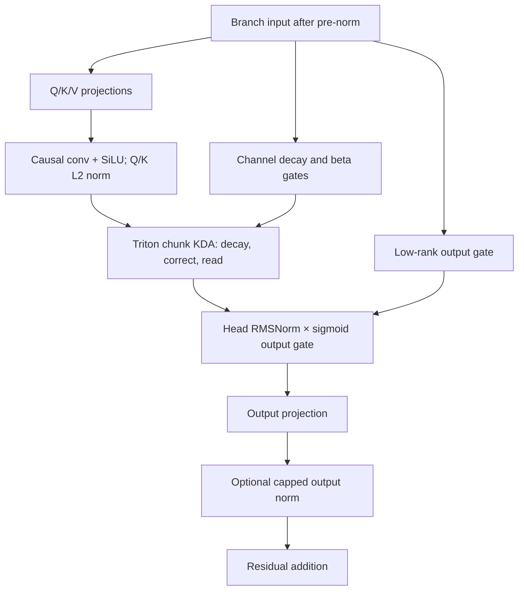
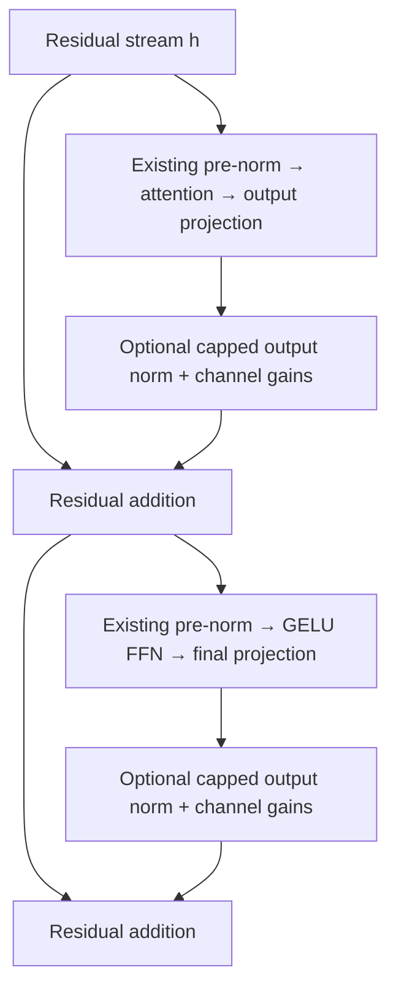

Historical architecture notes from the KDA release. Use the root README for current launch instructions.

# Muon sweep with Kimi Delta Attention: attention × output norms × context

Compare **softmax SDPA, fused ReLU², fused linear-at-16, and Triton Kimi Delta Attention (KDA)** at training contexts
**512, 1,024, and 2,048**, each with **both output norms off** or **both output norms on**.
Every run uses Muon for decoder weight matrices plus auxiliary AdamW for embeddings,
gains and scalar parameters. There are **24 runs**, one seed, and approximately
**100M training tokens per run**, with **no wall-time limit**.

This is a separate experiment folder. Reuse the previous prepared data and working
environment; start new run directories. Earlier sweeps and checkpoints remain intact.

## Start on the 4090

Extract into the new `relu2-50m-muon-output-norm-kda/` folder beside your previous experiment. Do not overwrite the earlier project or resume its run directory with this code:

```bash
cd ~/relu2triton_experiments/relu2-50m-muon-output-norm-kda
export RELU2_PYTHON="$HOME/relu2triton_experiments/relu2-100m-comparison/venv/bin/python"
export RELU2_DATA="$HOME/relu2triton_experiments/relu2-100m-comparison/data/fineweb_full"

"$RELU2_PYTHON" scripts/check_install.py
bash scripts/install_kda.sh
bash scripts/run_output_norm_4090.sh --data "$RELU2_DATA" --check-only
bash scripts/run_output_norm_4090.sh --data "$RELU2_DATA"
```

Set `RELU2_PYTHON` to whichever **working** project interpreter contains CUDA PyTorch,
Triton, Transformers **4.44.2**, and tokenizers **0.19.1**. The launcher prints the
interpreter, and preflight checks the actual versions and native `torch.optim.Muon`
before scheduling workers. It does not silently substitute another optimizer.
Keep your CUDA PyTorch/Triton installation. The requirements file pins the supporting
HF/data/report packages without replacing PyTorch.

Open **http://localhost:8774**. For access from another device on your trusted network,
add `--host 0.0.0.0 --port 8774`, then open `http://WORKSTATION_IP:8774` through your
existing private network/tunnel. The dashboard also supports mobile layouts.

The default output is `runs/muon_output_norm_kda_50m`. Workers run sequentially on one GPU.
The monitor updates during training. Stop with Ctrl+C to checkpoint after the current
optimizer step; continue with the same command and `--resume`:

```bash
bash scripts/run_output_norm_4090.sh --data "$RELU2_DATA" --resume
```

To start with one context and both conditions, then fill the rest:

```bash
bash scripts/run_output_norm_4090.sh --data "$RELU2_DATA" --contexts 1024
bash scripts/run_output_norm_4090.sh --data "$RELU2_DATA" --resume
```

An optional `--output-norms none` or `--output-norms capped` selects only one condition.
Use `--dry-run` to inspect the plan without loading models. A custom preset requires
a new output directory: `--preset configs/YOUR.json --output runs/YOUR_EXPERIMENT`.
There are no `--hours` or deadline-extension arguments.

## KDA architecture and Triton backend

Moonshot links its KDA implementation to [Flash Linear Attention](https://github.com/MoonshotAI/Kimi-Linear). This package pins **fla-core 0.5.2** and **einops 0.8.1**, with both wheels included. `install_kda.sh` installs only those two wheels using `--no-deps`; it keeps the existing PyTorch, Triton and Transformers. The full `flash-linear-attention` model package is unnecessary and may require newer Transformers. Installation and preflight report failures before training workers start.

This adds **pure KDA in all 17 attention layers**, as an additional arm of our dense GELU backbone. It does **not** reproduce the released Kimi Linear 3:1 KDA/MLA hybrid, its MoE, or its trained checkpoints. No published Kimi speedup or accuracy is assumed for these small models.

For each head, after causal four-tap depthwise convolutions and SiLU, Q/K are L2-normalized. The model predicts a channel-wise decay `alpha` and scalar update strength `beta`. With previous state `S`, key `k`, value `v`, query `q`:

```python
D = alpha[:, None] * S              # decay each key-feature row
error = v - k @ D                    # prediction error for this key
S = D + beta * k[:, None] * error[None, :]  # correct the memory
output = (q / sqrt(head_dim)) @ S    # read after writing current token
```

`alpha = exp(-exp(A_log) * softplus(f_proj(x) + dt_bias))`; `beta = sigmoid(b_proj(x))`. Forget and output gates use rank **128** at the real model size. The output passes through **head-wise RMSNorm and a sigmoid gate**, then the output projection. This inherent KDA norm stays enabled in **both** arms; only the extra full-384-dimensional capped norms toggle.



CUDA training uses FLA `chunk_kda` with backward, fused Q/K L2 normalization, decay processing and beta sigmoid. Short convolutions and gated head norm also use FLA Triton. Short inference queries under `no_grad()` use `fused_recurrent_kda`; gradient-enabled calls always use the differentiable chunk path, including in eval mode. There is no silent Torch fallback on CUDA. CPU reference recurrence is for smoke/correctness checks only.

Each layer caches one FP32 `[batch, 3, 128, 128]` memory plus three short convolution histories. Training/validation reset this memory for every packed sequence; states are not carried between minibatches or optimizer steps. Padding tokens are removed before recurrence so they cannot decay memory or advance convolution history. No RoPE is applied in KDA; the original arms keep their original RoPE and learned QK scale. The PyTorch capped output norms remain outside the Triton attention kernels.

Choose `--variants kda` to schedule only its six new runs in a fresh output. The other 18 cells remain pending until scheduled; the dashboard does not automatically import older runs with a different source/environment identity. Omitting that selector schedules all 24 conditions. Source/env changes are deliberately not accepted as an in-place resume.

Primary references: [Kimi Linear paper, §§3–4](https://arxiv.org/abs/2510.26692), [FLA KDA kernels](https://github.com/fla-org/flash-linear-attention/tree/main/fla/ops/kda), [FLA KDA layer](https://github.com/fla-org/flash-linear-attention/blob/main/fla/layers/kda.py). See `third_party/README.md` for the exact bundled wheel hashes.

## Exact norm definition

Let `x` be one token's full branch output vector, `d=384` its feature width,
`r = sqrt(mean(x²)) = ||x||₂/sqrt(d)`, and `g` a learned vector of `d` gains.
Each attention and FFN output norm owns its own `g`, initialized to all zeros.
The effective gains `1+g` therefore start uniformly at one, then learn independently.

```text
radial_output = x / max(1, r)
y = (1 + g) * radial_output
```

Only vectors with **||x||₂ > sqrt(d)** are radially normalized. Smaller vectors are
not enlarged to the sphere. At initialization, smaller vectors pass through exactly;
larger vectors are projected to radius `sqrt(384) ≈ 19.596` before dtype rounding.
No epsilon is needed because the denominator is at least one. Reductions, radial
scaling and affine gain arithmetic use FP32 for production FP16/BF16/FP32 inputs,
then return the input dtype. FP64 is retained for the derivative tests.

**Interpretation of the affine gain:** as in RMSNorm, the per-channel gain applies
on both sides of the threshold. Below the threshold only the radial operation is
identity; a learned gain can still change the vector. This keeps the operation
continuous at the threshold. Gain is applied **after** the radial cap and can move
the final output beyond radius sqrt(d) or alter its direction. This experiment does
not clip a second time after gain. Radius diagnostics record both input and final
output RMS. At the non-differentiable threshold, the implementation selects the
identity-side subgradient. Zero inputs have finite forward and backward values.

The [PyTorch RMSNorm definition](https://docs.pytorch.org/docs/2.14/generated/torch.nn.RMSNorm.html)
uses a channelwise affine scale. The capped denominator and zero-centered `1+g`
parameterization here are the explicit experimental changes; this is not a call to
standard RMSNorm. Existing pre-norm and final RMSNorm modules remain unchanged.

## Placement inside every decoder layer

Let `h` be the residual stream; `N_attn` and `N_ffn` the existing pre-norms;
`A` the full attention module including its output projection; and `F` the full
GELU FFN including its final projection. `C_attn` and `C_ffn` are the new norms:

```text
attention_branch = A(N_attn(h))
h_next = h + C_attn(attention_branch)
ffn_branch = F(N_ffn(h_next))
h_out = h_next + C_ffn(ffn_branch)
```



The norms span all 384 output channels, **not each 128-dimensional head**. They act
on branch outputs before the residual sum, not on the sum itself. The no-norm arm
uses identity operations without gain parameters. Both output norms switch together;
this preset does not include attention-only or FFN-only ablations.

The original ReLU²/linear Triton attention kernels are unchanged. KDA uses the separately pinned FLA backend. The new output norm runs in PyTorch
outside attention fusion. Full-step training timing includes its actual forward,
backward and gain-optimizer cost. This package does not claim it is free or faster.

## Model, data and matched budget

| Setting | Value |
|---|---|
| Width / layers / heads / head dimension | **384 / 17 / 3 / 128** |
| MLP / vocabulary | GELU, width 1,536 / 50,304 |
| WTE and LM head | Tied |
| Positions / attention input norm | Original arms: RoPE / QK L2 with learned scale starting at 20. KDA: no RoPE / QK L2 after causal convolution + SiLU, fixed attention scale 1/√128 |
| Attention rules | `softmax_sdpa`, `relu2`, `linear16`, `kda` |
| Output norm conditions | `none`, `capped` (attention + FFN together) |
| Training contexts | **512 / 1,024 / 2,048** |
| Seed | 0, single-seed screening |
| Original-arm parameters without / with output norms | **49,411,217 / 49,424,273** |
| KDA parameters without / with output norms | **52,866,739 / 52,879,795** |
| Training tokens per update | **32,768** |
| Updates / actual tokens per run | **3,052 / 100,007,936** |
| Microbatch sequence count by context | **8 / 4 / 2**, each with 8 accumulation steps |
| Validation targets per check | 131,072, same held-out prefix |
| Validation cadence | Every 150 updates and at the final budget |
| Shared validation context | **512** for all models |
| LR horizon | 100-update warmup, cosine to 10% of initial LR, full 3,052 updates |
| Global gradient norm clip / dropout | 1.0 / zero |

Total scheduled training is **2,400,190,464 tokens across 24 runs**. The requested
100M budget is rounded up by 7,936 tokens to complete optimizer updates.

The capped condition adds `2 × 17 × 384 = 13,056` gain parameters, so parameter
counts intentionally differ between norm conditions. KDA adds another **3,455,522 parameters** (about 7%) versus the original attention modules. This is a matched-backbone/token experiment, not an exactly parameter-matched comparison. We keep the 384-wide, 17-layer backbone and GELU FFN intact.

For a given seed, all compatible backbone and Q/K/V/output projection weights are copied from the original initialization into KDA. KDA-specific gates, filters and head norm are additional parameters. Norm on/off starts from identical shared weights within each architecture family; initialization hashes are checked within those families. Zero output-gain parameters consume no random initialization.

Training uses the same prepared token prefix, order, optimizer-update token count,
LR schedule, and validation cadence. Longer training contexts also give more context
at native evaluation. The separate common-512-context plot keeps evaluation windows
identical, allowing that effect to be distinguished. The original 256-context common
plot from the previous sweep is not directly comparable to this new common-512 plot.

Prepared data needs at least **100,007,937 training tokens** and **131,073 validation
tokens**. Tokenizer and data hashes are verified. If the previous stream is available,
no data download is needed. Otherwise:

```bash
"$RELU2_PYTHON" -m context_sweep.prepare --output data/fineweb_100m \
  --train-tokens 100010000 --validation-tokens 200000
```

## Muon and auxiliary AdamW

Decoder Q/K/V/output and FFN weight matrices use native `torch.optim.Muon`. KDA also sends its forget/output/beta projection matrices and depthwise convolution filters to Muon. Filters are stored as `[channel, tap]` 2D matrices (equivalent to flattening their singleton Conv1d axis), so native Muon can update them directly.
Tied WTE/LM-head weights use auxiliary AdamW once. Existing RMSNorm gains,
learned QK scales, all capped output gains, and KDA head-norm gains, output-gate biases, `A_log` and `dt_bias` use auxiliary AdamW without weight decay.
This follows the [Muon reference's parameter routing convention](https://github.com/KellerJordan/Muon),
with the explicit hyperparameters retained from the previous Muon experiment:

| Parameter group | Peak LR | Weight decay | Other settings |
|---|---:|---:|---|
| Muon decoder matrices | 0.02 | 0.1 | Momentum 0.95, Nesterov, 5 NS steps, `adjust_lr_fn="original"` |
| AdamW tied embedding/head | 0.0006 | 0.1 | Betas (0.9, 0.95), epsilon 1e-8 |
| AdamW norm gains/scalars | 0.0006 | **0** | Same betas/epsilon |

In the original arms Muon receives **30,081,024 parameters** in either norm condition. In KDA it receives **33,521,280**, including 78,336 convolution-filter parameters. Auxiliary AdamW owns
19,316,736 tied embedding/head parameters plus 13,457 non-matrix parameters without
output norms, or 26,513 with them. KDA instead has 28,723 or 41,779 non-matrix parameters. Each run saves `optimizer_groups.json` listing
all tensor names, shapes and assignments. Momentum/moments, RNG states, token cursor
and schedule position are included in resume checkpoints. Changed configs, code,
data or environments are rejected on resume instead of silently mixing experiments.

## Intermediate reports and graphs

The coordinator visits all selected runs in rounds near **25M → 50M → 100M tokens**.
Each round saves and resumes the same run; it does not restart the learning-rate
schedule. This gives early comparable measurements across all attention/norm pairs.
The default retains the latest full resume checkpoint plus a final HF export.

Under `runs/muon_output_norm_kda_50m/live/`:

- `best_validation_vs_context.png/.pdf/.svg`: eight best-loss curves at native context.
- `common_context_validation.png/.pdf/.svg`: eight curves using identical 512-token validation windows.
- `output_norm_delta.png/.pdf/.svg`: paired **capped minus no output norm** best native loss. Negative favors the capped arm. Only completed pairs appear.
- `sweep_results.csv`: native/common best losses, final native loss, parameter counts, token progress, throughput, and latest norm activity.
- `paired_deltas.csv`: best native/common and final-native paired loss differences.
- `validation.csv`: every validation measurement, token count and best-loss eligibility.
- `output_norm_diagnostics.csv`: per-layer, per-branch input/output mean/max RMS, fraction above the radius, and effective-gain mean/min/max.
- `report.md`, `live_data.json`, `index.html`: live report and browser dashboard.

Colors identify attention rules. **Solid/circles = no output norm; dashed/squares = capped outputs.**
Filled points have completed the full budget for all planned seeds. Hollow points
are incomplete best-so-far measurements. Pending and failed runs are not zero scores.
There are 21 eligible post-update validation checks per completed default run;
initial and pause-only evaluations are excluded from best-loss selection.
Single-seed curves have no uncertainty estimate. Additional seeds can be configured
in a copied preset and a separate output, with paired deltas computed seed by seed.

Diagnostics run only in the native-context validation pass, outside training-step
timing. They are collected for both conditions. For `none`, the above-radius fraction
is a **counterfactual** indication of where normalization would have acted. If radial
clipping rarely activates, differences can still arise from learned per-channel
gains; the result does not isolate radial clipping from those added gains.

The dashboard refreshes tables every 10 seconds and static context graphs every
60 seconds. It also plots validation versus training tokens for a selectable context.
When training stops, report files remain. Reopen the monitor at any time:

```bash
"$RELU2_PYTHON" -m context_sweep.monitor --root runs/muon_output_norm_kda_50m --port 8774
```

## Hugging Face and validation

Final checkpoints include the custom norm module and saved `output_norm` config:

```python
from transformers import AutoModelForCausalLM
model = AutoModelForCausalLM.from_pretrained(
    "runs/muon_output_norm_kda_50m/ctx1024_linear16_muon_norm-capped_seed0/final",
    trust_remote_code=True,
)
```

See `VALIDATION.md` for the checks actually performed. The complete GPU sweep still
needs your 4090. To run the CUDA integration and KDA accuracy cases first:

```bash
"$RELU2_PYTHON" -m pytest -q tests/test_cuda_training.py tests/test_kda.py
```

An optional CPU smoke command exercises all 24 conditions on tiny synthetic data:

```bash
"$RELU2_PYTHON" -m experiment.smoke --output runs/output_norm_cpu_smoke
```

Smoke results validate the pipeline only; they do not measure full-model quality or
GPU performance. `hf_model/output_norm.py` contains the new norm; the two placements
are in `ComparisonBlock` in `hf_model/modeling_comparison.py`. Earlier attention
kernel files remain byte-for-byte unchanged.
